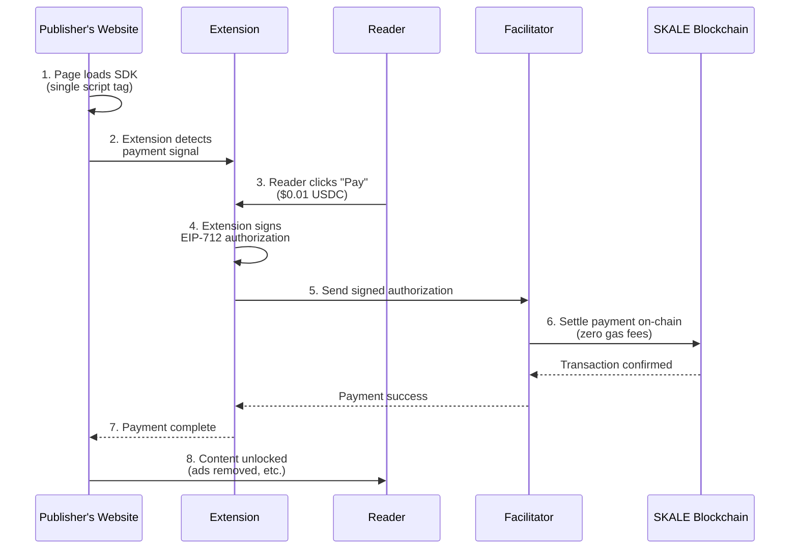

<div align="center">
  

# Paperwall

  **Micropayments for the open web.** Pay a penny to read an article -- no subscriptions, no ads, no tracking.

</div>

Paperwall is an open-source micropayment system that makes it easy for readers (humans and agents) to unlock content for just pennies. By using crypto (currently USDC on SKALE), payments can be as low as $0.01. It works for everyone: publishers get a single script tag, readers get a quick browser extension, AI agents use a batteries-included CLI tool or A2A server. It's that simple.

> **Status:** Testnet only. Paperwall is a hackathon project currently deployed on the SKALE testnet. Use test funds only. Not yet production-ready.

---

## The problem

The web's dominant monetization model -- advertising -- creates a lose-lose cycle:

1. **Publishers** earn very little from ads ($0.001-0.005 per page view) and face declining revenue as ad-blockers grow
2. **Users** suffer poor UX from intrusive ads, leading them to install ad-blockers (uBlock Origin, AdGuard, Pi-hole)
3. **Publishers retaliate** by blocking ad-blocker users, creating a cat-and-mouse arms race
4. **Nobody wins:** publishers lose revenue, users lose access, trust erodes on both sides

And it's getting worse. **AI agents** -- crawlers, LLM-powered tools, automated workflows -- now account for a growing share of web traffic. They don't see ads (so publishers earn nothing from agent visits), and they can't get past traditional paywalls either. Publishers have no way to monetize this traffic at all.

The existing alternatives have critical flaws:

- **Subscriptions** add friction -- users won't pay $10/month to read 2 articles, and AI agents can't sign up
- **Traditional micropayments** failed because transaction fees (0.30+ per card transaction) make 0.01 payments impossible
- **Standard crypto** is too complex: high gas fees and the need for technical knowledge make it unusable for mainstream users and agents alike.

### What changed

Three enablers now make micropayments viable:

1. **SKALE Network** -- EVM-compatible chain with ultra-low fees, making $0.01 transactions economically viable
2. **x402 protocol** -- standardized HTTP 402 Payment Required flow for web-native micropayments
3. **Kobaru facilitator** -- the engine that handles verification and settlement, hiding all the blockchain complexity from users and publishers.

### The opportunity

Build an open-source micropayment toolkit that lets publishers replace paywalls and ads with per-page-view payments as low as $0.001.

- **For Publishers:** a simple SDK to copy and get up and running.

- **For Humans:** a sleek browser extension for instant access.

- **For AI Agents:** an easy-to-setup CLI tool and A2A server.

---

## How it works



**Key features:**

- **Ultra-low fees** -- SKALE network has ultra-low transaction costs
- **True micropayments** -- charge as little as $0.001 per article
- **No account signup** -- readers just install the extension and set a password
- **Private key never leaves your device** -- wallet is encrypted locally
- **Open source** -- every line of code is auditable

### AP2 reference implementation

Paperwall is a **reference implementation** of the [AP2 (Agent Payment Protocol)](https://ap2-protocol.org/) for web content micropayments. AP2 defines how AI agents handle payments with accountability and cryptographic evidence.

Every transaction produces an AP2 receipt with three possible stages:

- **intent** -- authorization created, budget checked
- **settled** -- payment completed on-chain with blockchain transaction hash
- **declined** -- budget limit exceeded with structured decline reason

Paperwall demonstrates how AP2 applies to micropayment scenarios using the [x402 protocol](https://x402.org/) for content delivery, distinct from e-commerce use cases like shopping carts. See the **[A2A server guide](docs/a2a-server-guide.md#ap2-implementation-for-x402-micropayments)** for implementation details.

---

## Choose your path

Pick the guide that fits you.

### I'm a publisher -- I want to add a paywall to my site

You create great content and want to get paid for it without cluttering your site
with ads or adding a paywall. The best part? No blockchain or coding knowledge required.

**[Publisher guide](docs/publisher-guide.md)** -- Step-by-step setup with copy/paste code snippets.

**[Pricing & Economics](docs/pricing-economics.md)** -- Why micropayments work, pricing strategy, revenue modeling.

**[FAQ](docs/faq.md#for-publishers)** -- Common questions about costs, integration, and security.

### I'm a reader -- I want to pay for content I enjoy

You want an ad-free web and don't mind paying a few cents per article—all in a way that is simple, private, and fair.

**[User guide](docs/user-guide.md)** -- Install the extension, create a wallet, and start reading.

**[FAQ](docs/faq.md#for-readers)** -- Common questions about costs, safety, and privacy.

### I'm an AI agent user -- I want Claude or Gemini to access paywalled content

You use Claude Code, Gemini CLI, Cursor, Antigravity, or another AI agent and want it to pay for paywalled articles on your behalf.

```bash
curl -fsSL https://raw.githubusercontent.com/kobaru-io/paperwall/main/packages/agent/install-remote.sh | bash
```

**[MCP server guide](docs/mcp-server-guide.md)** -- Recommended. Native tool calls and live resources via MCP protocol.

**[AI agent setup](docs/ai-agent-setup.md)** -- Alternative skill-based setup for clients without MCP support.

### I'm a developer using the CLI agent or A2A server

Build apps and agents that can pay for what they consume. No browsers, no clicks—just the CLI and our A2A server.

**[Agent CLI guide](docs/agent-cli-guide.md)** -- All CLI commands: wallet, budget, fetch, history.

**[A2A server guide](docs/a2a-server-guide.md)** -- Run Paperwall as a server for other AI agents (JSON-RPC, receipts, Docker).

### I'm a developer -- I want to contribute or understand the code

You want to understand the architecture, run the project locally, or submit a pull request.

**[How Paperwall works](docs/how-it-works.md)** -- Plain-language overview of paywalls and payment flow.

**[Developer guide](docs/developer-guide.md)** -- Setup, building, testing, and code structure.

**[Architecture deep dive](docs/architecture.md)** -- Component internals, security model, and protocol details.

**[Contributing](CONTRIBUTING.md)** -- How to submit issues and pull requests.

**[Roadmap](docs/roadmap.md)** -- Current status, planned features, and development phases.

**[FAQ](docs/faq.md#for-developers)** -- Common questions about the tech stack and contributing.

---

## Quick start

### For publishers

Add this script tag to any page you want to paywall:

```html
<script src="https://cdn.jsdelivr.net/npm/@paperwall/sdk/dist/index.iife.js"
  data-facilitator-url="https://gateway.kobaru.io"
  data-pay-to="YOUR_EVM_ADDRESS"
  data-price="10000"
  data-network="eip155:324705682"
></script>
```

Configuration notes:

- `data-pay-to`: Your wallet address where you want to receive USDC payments
- `data-price="10000"`: $0.01 USDC (USDC uses 6 decimals, so 10000 = 0.01)
- `data-network="eip155:324705682"`: SKALE Base Sepolia testnet (ultra-low fees)

USDC contract (`0x2e08028E3C4c2356572E096d8EF835cD5C6030bD`) is configured at the facilitator level.

See the full **[publisher guide](docs/publisher-guide.md)** for configuration details.

### For readers

1. Install the Paperwall extension (manual install during alpha -- see [user guide](docs/user-guide.md))
2. Create a wallet with a strong password
3. Fund your wallet with SKALE testnet USDC
4. Visit a Paperwall-enabled site and click "Pay" when prompted

### For developers

```bash
git clone https://github.com/kobaru-io/paperwall.git
cd paperwall
npm install
npm run build
npm test        # 300+ tests across all packages
```

Load the extension in Chrome for development:

1. Open `chrome://extensions`
2. Enable "Developer mode"
3. Click "Load unpacked" and select `packages/extension/dist`

### Try the demo

Run a local demo news site to see Paperwall in action:

```bash
npm run demo
```

Then open http://localhost:8080 in your browser. The demo includes three paywalled articles at $0.01 each.

See **[demo/README.md](demo/README.md)** for detailed instructions including testing with the agent CLI and A2A server.

---

## Project structure

```
paperwall/
  packages/
    sdk/          Publisher SDK (~5 KB IIFE bundle, zero runtime dependencies)
    extension/    Chrome extension (MV3, TypeScript)
    agent/        CLI tool + A2A server for programmatic/agent access
  demo/           Demo news site with Paperwall integration
  test/           Cross-package integration tests
  docs/           Documentation
```

---

## Technology

| Component  | Stack                                                                   |
| ---------- | ----------------------------------------------------------------------- |
| SDK        | TypeScript, builds to IIFE for `<script>` tag usage                     |
| Extension  | TypeScript, Chrome Extension Manifest V3, Web Crypto API                |
| Agent CLI  | TypeScript, Node.js, Commander, viem                                    |
| Blockchain | SKALE Base Sepolia testnet (`eip155:324705682`), ultra-low fees         |
| Token      | Bridged USDC (`0x2e08028E3C4c2356572E096d8EF835cD5C6030bD`), 6 decimals |
| Payments   | EIP-712 typed data signing, `transferWithAuthorization` (EIP-3009)      |
| Security   | PBKDF2 (600k iterations) + AES-256-GCM wallet encryption                |

---

## Known limitations

**We’re still in the early stages. Here’s what you need to know:**

- **Chrome only** -- Firefox and other browsers are not supported yet
- **USDC only** -- no support for ETH or other tokens
- **SKALE network only** -- other L2s are not yet supported
- **Testnet phase** -- use test funds, not real money
- **Not on Chrome Web Store** -- manual install required during testnet

---

## License

[GPL-3.0](LICENSE)

---

## Authors

**Kobaru Team**
[www.kobaru.io](https://www.kobaru.io)

**Fabricio Gava** -- Engineering Lead
[LinkedIn](https://www.linkedin.com/in/fabriciogava/)

**Amanda Pestilo** -- UX Lead
[LinkedIn](https://www.linkedin.com/in/amandapestilo/)

---

## Contributing

Build the future of the web with us. Paperwall is open-source and evolves with the community. Want to contribute? Head over to our [CONTRIBUTING.md](CONTRIBUTING.md) for guidelines.

**Found a security vulnerability?** Please help us keep Paperwall safe by reporting it privately via a **[GitHub Security Advisory](https://github.com/kobaru/paperwall/security/advisories/new)** rather than opening a public issue.
