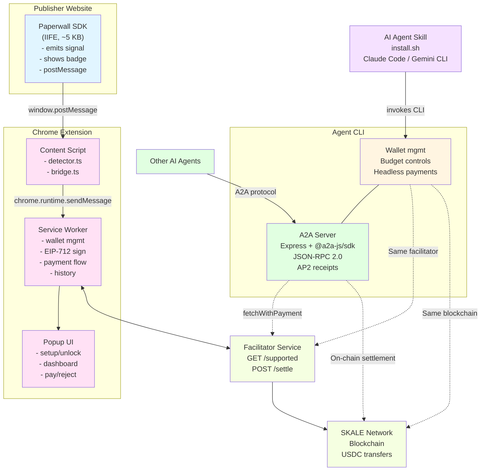
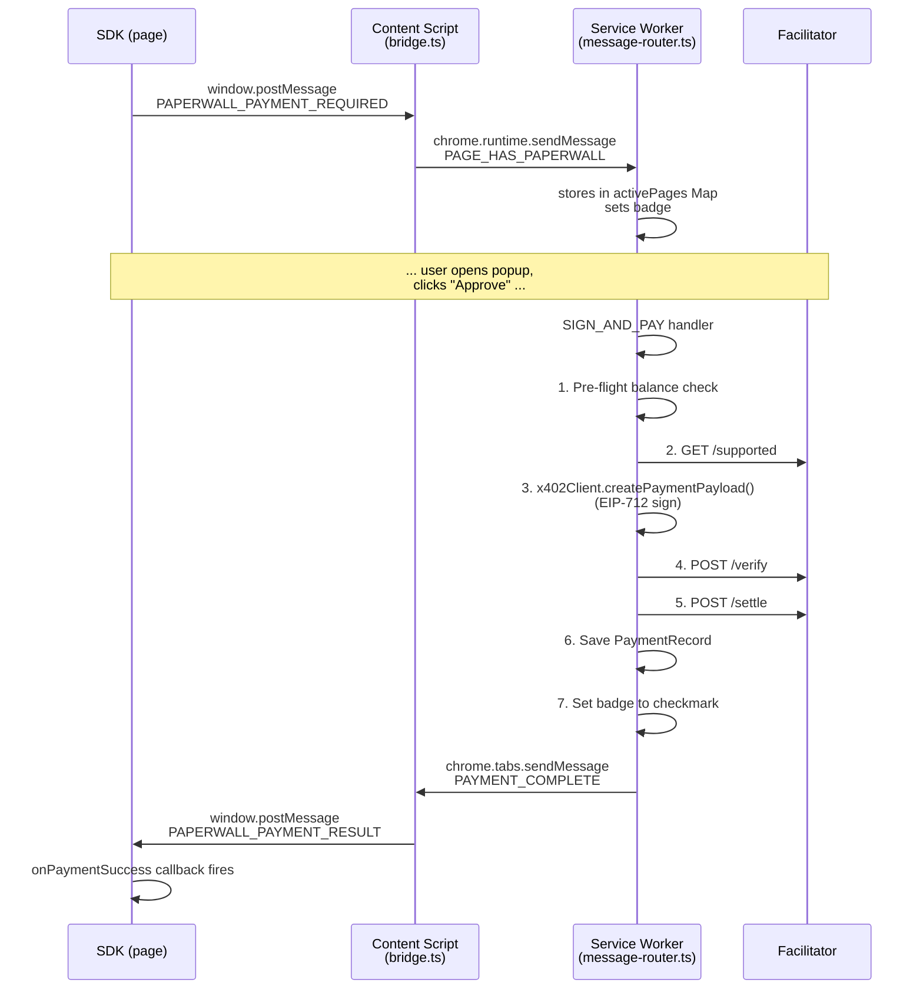
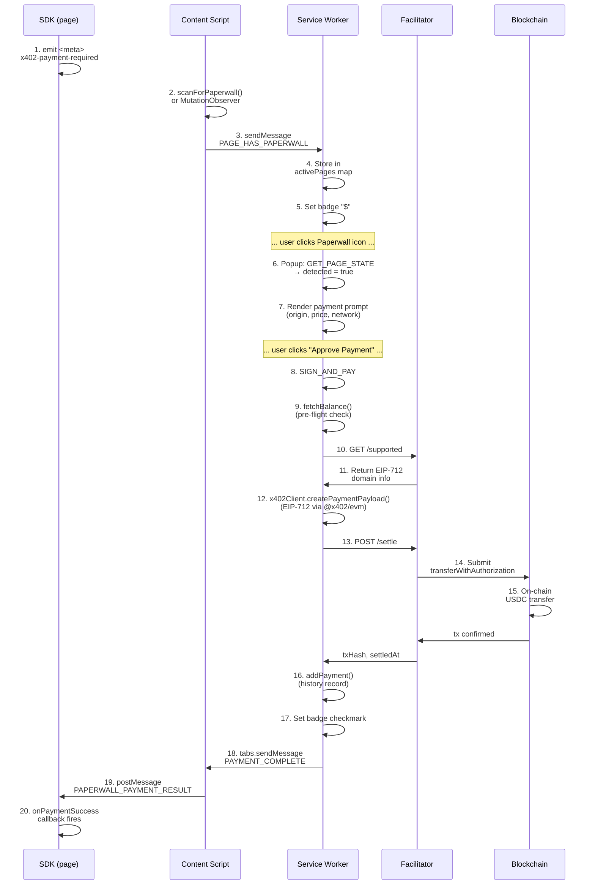

# Architecture

This document gives you a complete understanding of how Paperwall works -- from high-level component roles down to message formats, security boundaries, and on-chain settlement. Use it as a reference when doing code review, security review, or building new features.

## Table of Contents

1. [Overview](#overview)
2. [Trust tiers](#trust-tiers)
3. [Publisher SDK](#publisher-sdk)
4. [Browser extension](#browser-extension)
5. [Agent CLI](#agent-cli)
6. [AI agent skill](#ai-agent-skill)
7. [A2A Server](#a2a-server)
8. [Payment flow](#payment-flow)
9. [Security architecture](#security-architecture)
10. [Protocol details](#protocol-details)
11. [Data flow summary](#data-flow-summary)
12. [Integration testing](#integration-testing)

---

## Overview

Paperwall is a micropayment system that lets readers pay publishers as little as $0.01 USDC to access content. It uses the SKALE network for ultra-low-fee blockchain transactions and EIP-3009 (`TransferWithAuthorization`) so readers never pay gas directly.

The system has five components:

- **Publisher SDK** -- A tiny script tag (~5 KB) that publishers add to their pages. It advertises payment requirements to the reader's browser via a `<meta>` tag and `postMessage` signals.
- **Browser Extension** -- A Chrome MV3 extension that acts as a limited-scope wallet. It detects payment signals, manages an encrypted private key, signs EIP-712 authorizations, and communicates with the facilitator to settle payments on-chain.
- **Agent CLI** -- A headless Node.js tool that replicates the extension's payment flow for programmatic use. It adds budget controls, file-based storage, and support for HTTP 402 responses.
- **AI Agent Skill** -- An installer script and skill definition that integrates the Agent CLI with AI agents like Claude Code and Gemini CLI. It symlinks a skill file into the agent's skill directory and walks the user through wallet and budget setup.
- **A2A Server** -- An Agent-to-Agent protocol server (JSON-RPC 2.0) that wraps the Agent CLI's payment engine. Other AI agents discover it, send fetch requests, and receive content with structured AP2 receipts.

All five components share the same external dependency: a **facilitator service**, which defaults to `https://gateway.kobaru.io`. The facilitator provides EIP-712 domain info, verifies signatures, and submits on-chain transactions.



---

## Trust tiers

Paperwall supports three payment modes with different trust/complexity trade-offs:

| Tier | Who settles | Publisher setup | Backend required | Use case |
|------|-------------|-----------------|------------------|----------|
| **Tier 1: Client mode** | Extension calls facilitator | `<script>` tag only | No | Static sites, micropayments ($0.01-$0.10) |
| **Tier 2: Signed receipts** | Extension + cryptographic proof | `<script>` tag only | No | Medium value ($0.25-$1.00), audit trails |
| **Tier 3: Server mode** | Publisher's server | `<script>` + backend endpoint | Yes | High value ($5+), hard paywalls |

> **Why these tiers exist:** See [design-decisions.md](design-decisions.md) for the rationale behind the client-first architecture and progressive trust model.

---

## Publisher SDK

**Package:** `packages/sdk/` | **Key files:** `index.ts`, `config.ts`, `signal.ts`, `messaging.ts`, `badge.ts`

The SDK is a zero-dependency library that publishers add to their pages with a single `<script>` tag. It advertises payment requirements to the browser extension and handles the payment result callback.

### How the SDK initializes

When the IIFE bundle loads via a `<script>` tag, the entry point (`index.ts`) checks for `document.currentScript` and calls `autoInit()`. This reads `data-*` attributes from the script element and kicks off the full initialization:

1. **Parse config** -- `parseScriptTag()` reads `data-pay-to`, `data-price`, `data-network`, `data-facilitator-url`, `data-mode`, `data-asset`, `data-payment-url`, and `data-site-key` from the script element. `parseConfig()` validates all fields: URL format, Ethereum address format (0x + 40 hex chars), CAIP-2 network format, and positive integer amounts.
2. **Emit signal** -- `emitSignal()` creates a `<meta name="x402-payment-required">` tag in `<head>` with a base64-encoded JSON payload. The meta tag also carries `data-facilitator-url`, `data-mode`, and `data-site-key` attributes.
3. **Start messaging** -- `initMessaging()` posts a `PAPERWALL_PAYMENT_REQUIRED` message via `window.postMessage` and registers a listener for `PAPERWALL_PAYMENT_RESULT` responses.
4. **Show badge** -- `showBadge()` inserts a fixed-position visual indicator in the bottom-right corner of the page.

For bundled applications, you can skip the IIFE and call `Paperwall.init()` directly with a config object via the ESM or CJS export.

### Signal format

The `x402-payment-required` meta tag content is a base64-encoded JSON payload:

```json
{
  "version": "1",
  "resource": {
    "url": "https://example.com/article"
  },
  "offers": [
    {
      "payTo": "0x1234...abcd",
      "amount": "10000",
      "network": "eip155:324705682",
      "asset": "0x2e08028E3C4c2356572E096d8EF835cD5C6030bD"
    }
  ]
}
```

The meta tag also carries data attributes:
- `data-facilitator-url` -- facilitator service URL
- `data-mode` -- `"client"` or `"server"`
- `data-site-key` -- optional authentication key

### Extension detection

The SDK provides `sendPing()`, which posts a `PAPERWALL_PING` message and resolves to `true` if the extension responds with `PAPERWALL_PONG` within 2 seconds. This lets publishers detect whether the reader has the extension installed and show appropriate UI (for example, a "Get Paperwall" prompt for readers without the extension).

### Build outputs

| Bundle | Format | Use case |
|--------|--------|----------|
| `index.iife.js` | IIFE | `<script>` tag, self-initializing |
| `index.js` | ESM | `import` in bundled apps |
| `index.cjs` | CJS | `require()` in Node.js |

---

## Browser extension

**Package:** `packages/extension/` | **Key dirs:** `src/background/`, `src/content/`, `src/popup/`, `src/shared/`

The extension is structured as three isolated execution contexts with distinct security boundaries. It is intentionally a **limited-scope wallet** -- it handles payment signing and balance display, but does not support transfers, swaps, or dApp connections. See [Intentionally a Pseudo-Wallet](design-decisions.md#browser-extension-intentionally-a-pseudo-wallet) for the rationale behind this design choice.

### Content script (`src/content/`)

The content script runs in every page (`"matches": ["<all_urls>"]`) at `document_idle`. It bridges the gap between the page's SDK and the extension's service worker.

**Detector** (`detector.ts`):
- `scanForPaperwall()` queries the DOM for `meta[name="x402-payment-required"]` and parses the base64 content plus data attributes into a `DetectedPage` object.
- `observeForPaperwall()` watches `<head>` via `MutationObserver` for dynamically added meta tags. This handles single-page apps that add payment signals after initial load.

**Bridge** (`bridge.ts`):
- Listens for `window.postMessage` events with the `PAPERWALL_` prefix.
- Validates `event.origin === window.location.origin` -- rejects cross-origin messages, null origins, empty origins, and `about:` origins (sandboxed iframes).
- Translates `PAPERWALL_PAYMENT_REQUIRED` into `PAGE_HAS_PAPERWALL` and sends it to the service worker via `chrome.runtime.sendMessage`.
- Listens for `PAYMENT_COMPLETE` messages from the service worker (via `chrome.runtime.onMessage`) and relays them back to the page as `PAPERWALL_PAYMENT_RESULT`.
- Handles `PAPERWALL_PING` directly by responding with `PAPERWALL_PONG` -- no service worker involved.

### Service worker (`src/background/`)

The service worker is the security-critical core. It holds the encrypted wallet, signs transactions, and orchestrates payments.

**Index** (`index.ts`):
- Sets `chrome.storage.session` access level to `TRUSTED_CONTEXTS` (service worker + popup only, not content scripts). This prevents content scripts from reading the decrypted private key.
- Registers the message router.

**Message router** (`message-router.ts`):
Routes all extension message types to their handlers:

| Message type | Source | Handler | Sensitive |
|-------------|--------|---------|-----------|
| `CREATE_WALLET` | Popup | `handleCreateWallet` | Yes |
| `UNLOCK_WALLET` | Popup | `handleUnlockWallet` | Yes |
| `GET_WALLET_STATE` | Popup | `handleGetWalletState` | No |
| `GET_BALANCE` | Popup | `handleGetBalance` | Yes |
| `GET_HISTORY` | Popup | `handleGetHistory` | Yes |
| `PAGE_HAS_PAPERWALL` | Content script | `handlePageHasPaperwall` | No |
| `GET_PAGE_STATE` | Popup | `handleGetPageState` | No |
| `SIGN_AND_PAY` | Popup | `handleSignAndPay` | Yes |

Sensitive operations verify that the sender URL starts with `chrome-extension://{extensionId}/`. Content scripts and web pages cannot invoke wallet creation, unlock, payment, balance, or history operations.

**Key manager** (`key-manager.ts`):
- `generateKeyPair()` -- generates 32 random bytes via `crypto.getRandomValues` and derives the Ethereum address via viem.
- `encryptKey()` -- PBKDF2 (600k iterations, SHA-256) + AES-256-GCM with a 32-byte random salt and 12-byte random IV.
- `decryptKey()` -- reverses the encryption. Throws on wrong password because the GCM auth tag mismatch causes decryption to fail.

**Payment client** (`payment-client.ts`):
Delegates EIP-712 signing to the `@x402/evm` library (`ExactEvmScheme` via `x402Client.createPaymentPayload()`). The library signs a `TransferWithAuthorization` message (EIP-3009) using the facilitator's domain info:

- `validAfter` = `now - 600` (10-minute past buffer, set by library)
- `validBefore` = `now + 300` seconds (5-minute forward window)
- `nonce` = random 32-byte hex (prevents replay)
- Domain info (name, version, chainId, verifyingContract) comes from the facilitator's `GET /supported` response `extra` field

> **Note:** `signer.ts` still exists as a standalone module with the raw EIP-712 signing logic, but the main payment flow uses the x402 library via `payment-client.ts` to ensure wire-format compatibility with the facilitator.

**Facilitator client** (`facilitator.ts`):
- `getSupported(url, siteKey)` -- `GET /supported`, returns EIP-712 domain info
- `settle(url, siteKey, payload, requirements)` -- `POST /settle`, submits signed authorization
- `verify(url, siteKey, payload, requirements)` -- `POST /verify`, verifies a signature
- All requests have a 30-second timeout
- URL validation: HTTPS only, blocks private IPs (SSRF protection)

**Balance** (`balance.ts`):
- Queries USDC balance via raw `eth_call` to the SKALE RPC endpoint.
- ABI-encodes `balanceOf(address)` manually (selector `0x70a08231` + padded address).
- 30-second in-memory cache per address+network pair.

**History** (`history.ts`):
- Stores `PaymentRecord` objects in `chrome.storage.local`.
- Most-recent-first ordering, capped at 1,000 records (oldest dropped).

### Popup UI (`src/popup/`)

The popup is a vanilla TypeScript application with no framework. It programmatically creates DOM elements.

**Routing** (`index.ts`):
1. Sends `GET_WALLET_STATE` -- if no wallet exists, renders the setup screen.
2. If a wallet exists but is locked, renders the unlock screen.
3. If unlocked, queries the active tab for `GET_PAGE_STATE`.
4. If a Paperwall page is detected, renders the payment prompt.
5. Otherwise, renders the dashboard.

**Screens:**
- **Setup** -- password input (12+ characters, 3-of-4 character categories), confirm, create wallet.
- **Unlock** -- password input with brute-force counter display.
- **Dashboard** -- balance with refresh, truncated address with copy, recent payments, current page status.
- **Payment** -- site origin, price, network name, approve/reject buttons, processing state.

### Message flow

The full communication chain from page to blockchain:



### Extension manifest

```json
{
  "manifest_version": 3,
  "name": "Paperwall",
  "version": "0.1.0",
  "permissions": ["storage", "activeTab"],
  "host_permissions": ["<all_urls>"],
  "background": {
    "service_worker": "background.js",
    "type": "module"
  },
  "content_scripts": [{
    "matches": ["<all_urls>"],
    "js": ["content-script.js"],
    "run_at": "document_idle"
  }],
  "action": {
    "default_popup": "popup.html"
  },
  "content_security_policy": {
    "extension_pages": "script-src 'self'; object-src 'self'"
  }
}
```

**Permissions explained:**

| Permission | Why needed |
|-----------|-----------|
| `storage` | Persist encrypted wallet and payment history in `chrome.storage.local`; store decrypted key in `chrome.storage.session` |
| `activeTab` | Query the active tab to determine page state for the popup |
| `<all_urls>` (host permission) | Content script runs on all pages to detect Paperwall meta tags; service worker fetches SKALE RPC and facilitator endpoints |

---

## Agent CLI

**Package:** `packages/agent/` | **Key files:** `cli.ts`, `payment-engine.ts`, `wallet.ts`, `budget.ts`, `history.ts`, `storage.ts`, `crypto.ts`, `keychain.ts`, `key-cache.ts`

The Agent CLI replicates the extension's payment capabilities as a headless Node.js tool. It adds budget-based automated payment approval, file-based persistent storage, and support for all payment detection modes including HTTP 402.

### How the agent differs from the extension

| Feature | Extension | Agent |
|---------|-----------|-------|
| Wallet storage | `chrome.storage.local` | `~/.paperwall/wallet.json` (0o600) |
| Key resolution | Session storage | Env var > OS keychain > encrypted file (3 encryption modes) |
| Payment approval | User clicks "Approve" in popup | Budget system (automated) |
| History format | `chrome.storage.local` array | `~/.paperwall/history.jsonl` |
| 402 handling | Not supported | `@x402/fetch` integration |
| Config directory | N/A | `~/.paperwall/` with `0o700` permissions |

### Payment engine

The payment engine (`payment-engine.ts`) is the core of the agent. It handles four detection modes in priority order:

1. **HTTP 402** -- The initial fetch returns a 402 status. The engine uses the `@x402/fetch` library with `ExactEvmScheme` and budget-checking hooks (`onBeforePaymentCreation`). It intercepts the first fetch to avoid a redundant request and captures payment info via the `onAfterPaymentCreation` hook.

2. **Client mode** (HTTP 200 + meta tag, `mode="client"`) -- The agent calls the facilitator directly: `GET /supported` to get EIP-712 domain info, signs via `x402Client.createPaymentPayload()`, then `POST /settle`. This replicates the extension's behavior in a headless environment.

3. **Server mode** (HTTP 200 + meta tag, `mode="server"`) -- The agent signs and POSTs the payload to the publisher's `paymentUrl`. The publisher's backend calls the facilitator for settlement and returns the gated content.

4. **No payment** -- The page has no meta tag and returned HTTP 200. Content is returned as-is.

In all modes, the engine validates the USDC asset address against the expected address for the network, checks the budget before signing, and appends a history record after settlement.

### Budget system

The budget system (`budget.ts`) replaces the extension's manual user confirmation. Instead of asking "Approve payment?", the agent automatically approves if all budget constraints pass.

Three configurable limits (all stored in `~/.paperwall/budget.json`):
- **Per-request** -- Maximum amount for a single payment.
- **Daily** -- Rolling 24-hour spending cap. Checked by summing `history.jsonl` entries from the current day.
- **Lifetime** -- Total spending cap across all time.

Budget checks are **hard gates**, not advisory. If any limit is exceeded, the payment is declined and the process exits with code 2. The `--max-price` CLI flag acts as an additional per-request cap that overrides the budget's per-request limit when more restrictive. All arithmetic uses `BigInt` to avoid floating-point precision issues.

### Wallet management

The wallet (`wallet.ts`) supports two storage backends:

- **Encrypted file** (default) -- Private key encrypted with PBKDF2 (600k iterations) + AES-256-GCM and stored in `~/.paperwall/wallet.json` (0o600). Three encryption modes: machine-bound (key derived from hostname+uid), password (interactive), or environment-injected (`PAPERWALL_WALLET_KEY` env var).
- **OS keychain** -- Private key stored in the native credential manager (macOS Keychain, GNOME Keyring, Windows Credential Manager) via `@napi-rs/keyring` (optional dependency, dynamic import). The wallet file still contains metadata but not the key.

Key resolution follows a priority chain:
1. `PAPERWALL_PRIVATE_KEY` env var -- direct key for automation/CI/Docker.
2. OS keychain -- if wallet metadata has `keyStorage: "keychain"`.
3. Encrypted wallet file -- auto-decrypts using the detected encryption mode.

Resolved keys are cached in a process-lifetime `KeyCache` with pending-promise deduplication to prevent concurrent resolver invocations (e.g., double password prompts). The cache is wiped on process exit via `SIGINT`/`SIGTERM` handlers.

If none of these paths succeed, the agent exits with code 3.

### File-based storage

All agent data lives in `~/.paperwall/` (created with `0o700` permissions). Files are written with `0o600` permissions (owner read/write only). JSONL files use append-only writes, which makes them safe for concurrent reads and resistant to partial-write corruption. See the [agent CLI guide](agent-cli-guide.md#data-storage) for the full file inventory.

### Output and exit codes

**stdout** is valid JSON only. **stderr** is human-readable logs. Never mix them. Exit code 2 means "payment declined" (hard budget gate) and must not be retried. See the [agent CLI guide](agent-cli-guide.md#exit-codes) for the full table.

---

## AI agent skill

**Package:** `packages/agent/` | **Key files:** `install.sh`, `skills/paperwall/SKILL.md`, `skills/paperwall/references/cli-reference.md`

The AI agent skill is the integration layer between the Agent CLI and AI coding agents like Claude Code and Gemini CLI. It consists of an installer script and a skill directory that teaches the AI agent how and when to use the `paperwall` CLI.

### How the installer works

The `install.sh` script takes a single argument (`claude` or `gemini`) and performs four steps:

1. **Build and link** -- Runs `npm run build` in the agent package, then symlinks `dist/cli.js` to `~/.local/bin/paperwall`. No sudo required.
2. **Symlink the skill** -- Creates a symlink from the agent's skill directory (`~/.claude/skills/paperwall` or `~/.gemini/skills/paperwall`) to the `skills/paperwall/` directory in the package. Symlinks mean the skill stays up to date when the repo is pulled.
3. **Wallet setup** -- Prompts the user to create a new wallet or import an existing private key.
4. **Budget setup** -- Prompts the user to configure per-request, daily, and lifetime spending limits.

### Skill definition

The skill directory contains `SKILL.md` (the main skill prompt) and a `references/` subdirectory with `cli-reference.md`. The AI agent reads these as context. They describe:

- When to use the tool (paywalled content, HTTP 402 responses, `<meta>` payment tags)
- Available commands (`fetch`, `budget status`, `wallet balance`)
- Output format (JSON on stdout, logs on stderr)
- Exit code semantics (0=success, 2=budget exceeded, 3=no wallet)
- Budget-checking workflow (check budget before fetching)

The AI agent invokes the CLI as a shell command based on these instructions. No special API or SDK integration is required -- the skill is pure documentation that guides the agent's tool use.

For setup instructions, see the [AI agent setup guide](ai-agent-setup.md).

---

## A2A Server

**Package:** `packages/agent/src/server/` | **Key files:** `index.ts`, `executor.ts`, `request-orchestrator.ts`, `receipt-manager.ts`, `access-gate.ts`, `agent-card.ts`

The `paperwall serve` command starts an Agent-to-Agent protocol server built with Express and `@a2a-js/sdk`. It wraps the agent's `fetchWithPayment()` engine behind a standard A2A interface (protocol v0.3.0, JSON-RPC 2.0), allowing other AI agents to discover and pay for paywalled content.

### Endpoints and access control

The server exposes four endpoints: agent card discovery (public), JSON-RPC (`/rpc`, authenticated), receipt viewer (`/receipts`, authenticated), and health check (public). See the [A2A server guide](a2a-server-guide.md#endpoints-reference) for full endpoint documentation.

When `PAPERWALL_ACCESS_KEYS` is set, keys are compared using HMAC-based timing-safe comparison (`access-gate.ts`): both the provided key and each configured key are HMAC'd with SHA-256 using a fixed secret, then compared with `timingSafeEqual`. This prevents timing attacks that could leak key bytes.

### Request lifecycle

When an AI agent sends a `message/send` JSON-RPC request to `/rpc`, the flow is:

1. **Access gate** -- Bearer token is validated against configured keys.
2. **Executor** (`executor.ts`) -- The `PaperwallExecutor` extracts `url`, `maxPrice`, and `agentId` parameters from the message. It looks for a `data` part first (structured input), then falls back to extracting a URL from a `text` part.
3. **Request orchestrator** (`request-orchestrator.ts`) -- Wraps `fetchWithPayment()` with AP2 receipt creation. Builds an authorization context (budget limits, spent amounts), delegates to the payment engine, and creates a receipt based on the outcome.
4. **Receipt creation** (`receipt-manager.ts`) -- Creates a `Receipt` with a UUID, timestamp, authorization context, and settlement or decline context. Appends it to `~/.paperwall/receipts.jsonl`.
5. **Response** -- The executor publishes the result (content + receipt, or error + receipt) via the A2A event bus and signals completion.

### AP2 receipt lifecycle

Each request produces a receipt that tracks a payment through one of three stages: **intent** (request received, authorization context built), **settled** (payment completed on-chain), or **declined** (budget check failed). Receipts are stored as append-only JSONL. See the [A2A server guide](a2a-server-guide.md#ap2-receipt-lifecycle) for full stage details and the receipt viewer's filtering options.

The receipt viewer (`receipt-viewer.ts`) sets security headers: `X-Frame-Options: DENY`, `X-Content-Type-Options: nosniff`, and a strict Content Security Policy (`default-src 'none'; style-src 'unsafe-inline'`).

### Configuration

Server config follows a precedence chain: CLI flag > env var > `~/.paperwall/server.json` > default. See the [A2A server guide](a2a-server-guide.md#configuration) for the full config table.

### Server files

| File | Purpose |
|------|---------|
| `index.ts` | Express server setup, route wiring, A2A protocol handlers |
| `executor.ts` | `PaperwallExecutor` -- implements `AgentExecutor` interface from A2A SDK |
| `request-orchestrator.ts` | Wraps `fetchWithPayment()` with AP2 receipt creation |
| `receipt-manager.ts` | JSONL storage, block explorer URLs, filtering, pagination |
| `receipt-viewer.ts` | HTML receipt dashboard with summary stats |
| `access-gate.ts` | Bearer token auth with HMAC timing-safe comparison |
| `agent-card.ts` | Agent Card builder (protocol v0.3.0) |
| `config.ts` | Config resolution (CLI flag > env var > file > default) |
| `demo-client.ts` | AP2 lifecycle demo runner |
| `types.ts` | Receipt, ServerConfig, and context interfaces |

For a complete integration guide, see [A2A Server guide](a2a-server-guide.md).

---

## Payment flow

This section documents the payment flow for **Tier 1 (client mode)**, where the extension calls the facilitator directly. For Tier 2 (signed receipts), the flow is identical except the facilitator returns a signed receipt that the SDK verifies. For Tier 3 (server mode), the extension signs but does not call the facilitator -- instead, the SDK forwards the signature to the publisher's backend, which handles verification and settlement.

### Full payment sequence (Tier 1: client mode, extension)



### Error paths

| Step | Failure | Result |
|------|---------|--------|
| 9 | Insufficient balance | Error response, red `!` badge |
| 10 | Facilitator unreachable | Error response, red `!` badge |
| 12 | Signing fails | Error response, red `!` badge |
| 13 | Settlement fails | Error response, red `!` badge, failed payment recorded |
| Any | Concurrent payment for same tab | "Payment already in progress" error |

---

## Security architecture

> **Security model context:** Paperwall wallets hold small balances ($5-50) for micropayments only. This allows for a simpler security model (password-based encryption for the extension, machine-bound encryption for the agent, no MFA/passkeys) compared to general-purpose wallets. Users should never use Paperwall as their primary wallet. See [Intentionally a Pseudo-Wallet](design-decisions.md#browser-extension-intentionally-a-pseudo-wallet) for the security-through-segregation rationale.

### Threat model

| Threat | Mitigation |
|--------|-----------|
| Malicious web page reads private key | Private key in `chrome.storage.session` (TRUSTED_CONTEXTS), content scripts cannot access |
| Malicious web page triggers payment | Sensitive message types require `chrome-extension://` sender origin |
| Content script bridge cross-origin attack | Bridge validates `event.origin === pageOrigin`, rejects null/empty/about: origins |
| Facilitator URL SSRF | HTTPS-only + private IP blocklist (10.x, 172.x, 192.168.x, localhost, link-local, fe80, fc00, fd00) |
| Brute-force password guessing | 5-attempt lockout with 5-minute cooldown |
| Weak wallet password | Minimum 12 characters, 3-of-4 character categories required |
| Replay attack on payment | Random 32-byte nonce per transaction, 300-second validity window |
| Wallet file theft (agent) | File permissions 0o600, encryption keyed to machine/password/env var -- wallet is useless without the correct decryption context. Keychain backend delegates protection to the OS credential manager. |

### Key storage lifecycle

```mermaid
graph TD
    subgraph "1. Wallet Creation"
        A[generateKeyPair]
        B[privateKey in memory]
        C[encryptKey password, privateKey]
        D[PBKDF2 password, random_salt, 600k]
        E[derivedKey]
        F[AES-256-GCM derivedKey, random_iv, privateKey]
        G[ciphertext]
        H[store ciphertext, salt, iv<br/>in chrome.storage.local]
        I[store privateKey<br/>in chrome.storage.session<br/>TRUSTED_CONTEXTS]

        A --> B
        B --> C
        B --> I
        C --> D
        D --> E
        E --> F
        F --> G
        G --> H
    end

    subgraph "2. Browser Close"
        J[chrome.storage.session<br/>cleared automatically]
        K[privateKey gone]

        J --> K
    end

    subgraph "3. Wallet Unlock"
        L[decryptKey password, ciphertext, salt, iv]
        M[PBKDF2 password, salt, 600k]
        N[derivedKey]
        O[AES-256-GCM-decrypt<br/>derivedKey, iv, ciphertext]
        P{GCM auth tag<br/>mismatch?}
        Q["Incorrect password"]
        R[privateKey]
        S[store privateKey<br/>in chrome.storage.session]

        L --> M
        M --> N
        N --> O
        O --> P
        P -->|Yes| Q
        P -->|No| R
        R --> S
    end

    classDef creation fill:#e1f5ff
    classDef close fill:#ffe1f5
    classDef unlock fill:#f5ffe1

    class A,B,C,D,E,F,G,H,I creation
    class J,K close
    class L,M,N,O,P,Q,R,S unlock
```



### Content Security Policy

Extension pages use a strict CSP:

```
script-src 'self'; object-src 'self'
```

No inline scripts, no external scripts, no eval. All JavaScript is bundled at build time.

---

## Protocol details

### x402 signal format

The meta tag format and decoded JSON payload are documented in the [Publisher SDK > Signal format](#signal-format) section above.

### EIP-712 signature structure

**Domain:**

```json
{
  "name": "USD Coin",
  "version": "2",
  "chainId": 324705682,
  "verifyingContract": "0x2e08028E3C4c2356572E096d8EF835cD5C6030bD"
}
```

Domain parameters come from the facilitator's `GET /supported` response.

**Message (TransferWithAuthorization):**

```json
{
  "from": "0x<reader_address>",
  "to": "0x<publisher_address>",
  "value": "10000",
  "validAfter": "1739299500",
  "validBefore": "1739300100",
  "nonce": "0x<random_32_bytes>"
}
```

### Facilitator API

**`GET /supported`**

Returns supported payment schemes and EIP-712 domain info.

Response:
```json
{
  "kinds": [
    {
      "kind": "eip155:transferWithAuthorization",
      "extra": {
        "name": "USD Coin",
        "version": "2",
        "chainId": 324705682,
        "verifyingContract": "0x2e08028E3C4c2356572E096d8EF835cD5C6030bD"
      }
    }
  ]
}
```

**`POST /settle`**

Submits a signed authorization for on-chain settlement.

Request body contains a full x402 `PaymentPayload` envelope:
```json
{
  "paymentPayload": {
    "x402Version": 2,
    "resource": {
      "url": "https://example.com/article",
      "description": "",
      "mimeType": ""
    },
    "accepted": {
      "scheme": "exact",
      "network": "eip155:324705682",
      "asset": "0x2e08028E3C4c2356572E096d8EF835cD5C6030bD",
      "amount": "10000",
      "payTo": "0x<publisher_address>",
      "maxTimeoutSeconds": 300,
      "extra": { "name": "USD Coin", "version": "2" }
    },
    "payload": {
      "signature": "0x<eip712_signature>",
      "authorization": {
        "from": "0x<reader_address>",
        "to": "0x<publisher_address>",
        "value": "10000",
        "validAfter": "1739299500",
        "validBefore": "1739300100",
        "nonce": "0x<random_32_bytes>"
      }
    }
  }
}
```

Response (x402 `SettleResponse`):
```json
{
  "success": true,
  "transaction": "0x<transaction_hash>",
  "network": "eip155:324705682",
  "payer": "0x<reader_address>"
}
```

### Network configuration

| Network | CAIP-2 | Chain ID | RPC URL | USDC Contract |
|---------|--------|----------|---------|---------------|
| SKALE Testnet | `eip155:324705682` | 324705682 | `https://testnet.skalenodes.com/v1/lanky-ill-funny-testnet` | `0x2e08028E3C4c2356572E096d8EF835cD5C6030bD` |
| SKALE Mainnet | `eip155:1187947933` | 1187947933 | `https://mainnet.skalenodes.com/v1/wan-red-ain` | `0x85889c8c714505E0c94b30fcfcF64fE3Ac8FCb20` |

---

## Data flow summary

| Data | Where stored | Access |
|------|-------------|--------|
| Encrypted private key | `chrome.storage.local` | Persistent, survives restarts |
| Wallet address | `chrome.storage.local` | Persistent |
| Decrypted private key | `chrome.storage.session` | Service worker + popup only, cleared on browser close |
| Payment history | `chrome.storage.local` | Persistent, max 1000 records |
| Active page state | In-memory `Map<tabId, state>` | Service worker only, cleared on restart |
| Payment-in-progress lock | In-memory `Set<tabId>` | Service worker only, prevents concurrent payments |
| Unlock attempt counter | In-memory variables | Service worker only, reset on restart |
| Balance cache | In-memory `Map` | Service worker only, 30-second TTL |

---

## Integration testing

Integration tests (`test/integration/`) validate cross-package interactions -- ensuring the SDK, extension logic, agent CLI, and A2A server work together correctly.

**Test pyramid:**
- **Unit tests** (300+) -- each package tested in isolation with mocked dependencies
- **Integration tests** (numbered sequence) -- cross-package flows with real module interactions

**Numbered sequence:** Tests are named with numeric prefixes (`01-sdk-config.test.ts`, `02-extension-flow.test.ts`, etc.) to enforce execution order. Each test may depend on state or build artifacts from earlier tests.

**Sequential execution:** Integration tests run with `singleFork: true` in the Vitest config. This prevents port conflicts (the demo server uses port 8080, the A2A server uses port 4000) and ensures numbered tests run in order.

**Build requirement:** Integration tests import from built `dist/` directories, not source. Always run `npm run build` before `npm run test:integration`.

**Graceful skip:** If the facilitator service at `TEST_FACILITATOR_URL` is unreachable, tests that require on-chain settlement skip gracefully rather than failing. This allows the test suite to run in offline/CI environments.
