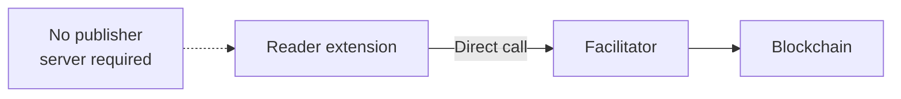
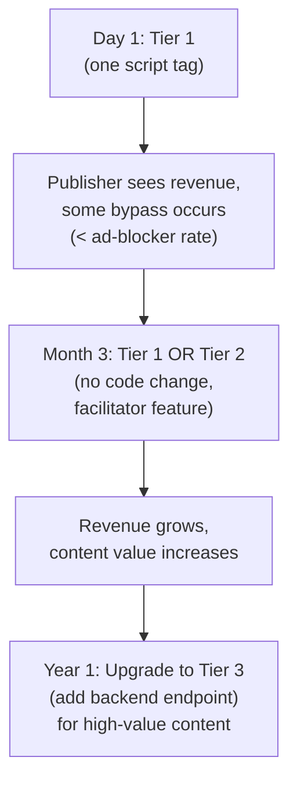

# Design Decisions

This document explains the **why** behind Paperwall's architecture. For the technical **what/how**, see [architecture.md](architecture.md).

## Table of Contents

1. [The Problem We're Solving](#the-problem-were-solving)
2. [Progressive Trust Tiers](#progressive-trust-tiers)
3. [Progressive Adoption Path](#progressive-adoption-path)
4. [Why Not Start with Tier 3 Only?](#why-not-start-with-tier-3-only)
5. [Extension Works in All Modes](#extension-works-in-all-modes)
6. [Browser Extension: Intentionally a Pseudo-Wallet](#browser-extension-intentionally-a-pseudo-wallet)
7. [Agent: Wallet Encryption and Storage](#agent-wallet-encryption-and-storage)
8. [Optimistic Settlement: Default-On for Tier 1 & 2](#optimistic-settlement-default-on-for-tier-1--2)
9. [Other Design Decisions](#other-design-decisions)

---

## The Problem We're Solving

**Target publishers:** Small-to-medium content creators currently using ad-supported models (blogs, independent journalism, niche magazines). They're losing 20-40% of revenue to ad-blockers.

**Barrier to adoption:** These publishers:
- Don't have backend development resources
- Use static site generators (Hugo, Jekyll, 11ty)
- Rely on platforms without server control (Medium, Substack, WordPress.com)
- Can't justify infrastructure investment for a payment experiment

**Traditional x402 (server mode)** requires:
- Backend endpoint to verify/settle payments
- Database to track payment state
- Server maintenance and monitoring
- Integration with existing CMS/platform

For a publisher charging **$0.01 per article**, this overhead is prohibitive. They need to process 1,000 payments just to cover one hour of developer time.

---

## Progressive Trust Tiers

### The Client-First Design Choice

Paperwall's default payment flow (Tier 1) is **unusual** compared to traditional web payments and even standard x402 flow, where the server calls the payment processor with a secret API key:


Paperwall Tier 1 inverts this: the **reader's browser extension** calls the facilitator directly, with no server involvement:



This is a **deliberate design decision** driven by our primary use case and adoption goals. It allows Paperwall to offer **three tiers** with increasing trust but also increasing complexity:

### Tier 1: Client Mode (MVP)

**Who calls facilitator:** Reader's extension
**Publisher setup:** One `<script>` tag
**Backend required:** No
**Trust model:** Honor system (client-side)

The extension handles the entire payment flow:
1. Detects payment signal from SDK
2. Shows payment prompt to reader
3. Signs EIP-712 authorization
4. Calls facilitator `/settle` endpoint
5. Notifies SDK of success
6. SDK triggers publisher's callback (hide ads)

**Security trade-off:** A malicious extension could forge a "success" message to the SDK without actually paying. This is **equivalent to installing an ad-blocker** — the reader bypasses monetization, but they can't steal funds or harm others.

**Why this is acceptable:**
- **Ad-blocker equivalence:** 20-40% of readers already bypass ads. A technical reader forging payments is no worse than the status quo.
- **Micropayment economics:** For $0.01 articles, the cost of enforcement exceeds the value protected.
- **Honest majority:** Most readers are honest (just like donation-based models work).
- **No financial loss:** The worst case is lost revenue, not stolen funds (the payment either happens or it doesn't — there's no chargeback fraud risk).

**Who this serves:**
- Static site publishers
- WordPress.com / Substack / Medium users (no backend control)
- Publishers experimenting with micropayments
- Content worth $0.01-$0.10 per page where bypass risk = ad-blocker risk

### Tier 2: Client Mode with Signed Receipts (Phase 1)

**Who calls facilitator:** Reader's extension
**Publisher setup:** Same `<script>` tag (no code change)
**Backend required:** No
**Trust model:** Cryptographically verified receipts

The facilitator returns a **signed receipt** after settlement. The SDK verifies:
1. Receipt signature is valid (facilitator's public key)
2. `receipt.payTo` matches SDK config
3. `receipt.amount` matches SDK config

A malicious extension **cannot forge** a valid signature because it lacks the facilitator's private key. It can only:
- Block payment (don't forward receipt) → publisher never grants access → no harm
- Redirect payment (change payTo) → facilitator signs with real payTo → SDK rejects mismatch → no harm

**Why this matters:**
- **Cryptographic proof:** Publishers have auditable evidence that payment occurred
- **No backend required:** Still a single script tag
- **Same latency:** Signature is returned with settlement (no extra round-trip)

**Who this serves:**
- Medium-value content ($0.25-$1.00)
- Publishers who need payment records for accounting
- Platforms where "pay once, share the callback" attacks are a concern

### Tier 3: Server Mode (Phase 1+)

**Who calls facilitator:** Publisher's server
**Publisher setup:** Script tag + backend endpoint
**Backend required:** Yes
**Trust model:** Full server-side verification

The extension collects the reader's signature but **does not call the facilitator**. Instead:
1. Extension returns signature to SDK
2. SDK forwards signature to publisher's server (`data-payment-url`)
3. **Publisher's server** calls facilitator `/verify` + `/settle` with secret API key
4. Publisher's server decides whether to grant access
5. Publisher's server returns result to SDK
6. SDK notifies extension (for UI/history update)

This is **standard x402 server-side flow**. The extension is just the wallet UX; the publisher controls settlement.

**Why this matters:**
- **Hard paywalls:** Content never sent to browser until payment verified
- **Server-side access control:** Integrate with existing auth systems
- **No client-side bypasses:** Technical readers cannot inspect source or forge callbacks
- **Audit logs:** Full server-side payment tracking

**Who this serves:**
- High-value content ($5+, subscriptions)
- Publishers with existing backend infrastructure
- Cases requiring server-side access control (API keys, downloads, premium features)

---

## Progressive Adoption Path

The three-tier model allows publishers to **start simple and upgrade as needed**:



**Key insight:** Publishers charging $0.01/article don't need the same security as publishers charging $120/year. The architecture **must not force all publishers to the highest security tier** just to experiment with micropayments.

---

## Why Not Start with Tier 3 Only?

If Paperwall only supported server mode (Tier 3):
- ❌ Static site publishers excluded (no backend to call facilitator)
- ❌ Small publishers can't experiment (infrastructure investment required upfront)
- ❌ High friction blocks adoption (most publishers give up before seeing revenue)
- ❌ Over-engineering for micropayments (security complexity exceeds value protected)

By offering **Tier 1 as the default**, we:
- ✅ Enable experimentation with zero infrastructure cost
- ✅ Reach publishers who can't run backend services
- ✅ Prove the micropayment model works before publishers invest in infrastructure
- ✅ Allow revenue-driven upgrades (start simple, upgrade when economics justify it)

---

## Extension Works in All Modes

The Paperwall extension provides the same reader experience in all three tiers:
1. Detects paywall signal
2. Shows payment prompt
3. Signs EIP-712 authorization
4. Handles payment flow (Tier 1 & 2) OR returns signature to SDK (Tier 3)
5. Updates UI, history, and balance

**The extension is always the reader's wallet interface.** The tier determines who calls the facilitator and how trust is verified. This separation allows the same extension to support publishers at all trust levels.

---

## Browser Extension: Intentionally a Pseudo-Wallet

### The Design Choice

Paperwall is **deliberately not** a general-purpose crypto wallet. We don't support:
- ❌ Transferring funds to other addresses
- ❌ Swapping tokens
- ❌ Managing NFTs or multiple assets
- ❌ Connecting to dApps via WalletConnect
- ❌ Importing existing wallets

This is not a feature gap — it's a **core design principle**.

### Why We Build a Limited Wallet

#### 1. Security Through Segregation

**Users must never use their main wallet for micropayments.**

- A wallet holding $5-20 for article payments should be **completely separate** from a wallet holding life savings
- If a malicious publisher tricks a user into overpaying, the blast radius is limited to the small balance
- Lost password = lost $10, not $10,000
- This segregation pattern is **fundamental to micropayment safety**

By making Paperwall a dedicated wallet, we enforce this best practice by design. Users can't accidentally expose their primary wallet to every blog they read.

#### 2. Simpler Security Model

**Small balances justify simpler security.**

Because Paperwall wallets hold small amounts ($5-50), we can:
- ✅ Skip passkeys/hardware wallet requirements
- ✅ Skip multi-factor authentication for every transaction
- ✅ Use password-only encryption (600k PBKDF2 iterations)
- ✅ Allow instant payments without confirmation prompts

If we were building a general wallet holding thousands of dollars, we'd need biometric auth, hardware security modules, social recovery, etc. For micropayments, that complexity **hurts usability more than it helps security**.

The security model matches the threat model: protect $20, not $20,000.

#### 3. The Grandma Test (KISS Principle)

**The extension should be so easy to use that even my grandma can use it.**

A general crypto wallet has:
- Gas fees to explain
- Token approval flows
- Network switching
- Transaction speed vs cost trade-offs
- Address formats (EVM vs non-EVM)
- Seed phrase backup ceremonies

Paperwall has:
- Set a password
- Click "Approve Payment"
- That's it

**Keep It Simple, Stupid.** Every feature we don't add is complexity we don't inflict on users.

#### 4. Blockchain as Invisible Infrastructure

**Users don't know what a mainframe is. They shouldn't need to know what a blockchain is.**

When you use a credit card:
- You don't think about ACH networks, interchange fees, or ISO 8583 messages
- You swipe/tap and it works

When you use Paperwall:
- You shouldn't think about gas, nonces, EIP-712, or chain IDs
- You click "Pay $0.05" and it works

**Blockchain is a payment technology, not an identity.** Our goal is to make crypto payments feel like normal payments. Exposing wallet features (swaps, transfers, dApp connections) would reinforce the "this is crypto" framing instead of "this is a micropayment tool."

### Future Vision: Transparent Payment Tech

As Paperwall evolves, we're moving **further away** from traditional crypto wallet UX:

- **Fiat onramps** — Users top up with credit cards, never see "USDC" or "bridging"
- **Auto-refill** — Balance drops below $5? Charge $10 to card automatically
- **Spending reports** — "You spent $3.42 on articles this month" (not "0.0034 ETH gas + 3.42 USDC")
- **No seed phrases** — Cloud backup with email recovery (controversial in crypto, normal everywhere else)

We're building a **payment tool that happens to use blockchain**, not a **blockchain tool that happens to enable payments**.

### What This Means for Developers

When adding features, ask:
- **Does my grandma need this?** If not, cut it.
- **Does this expose blockchain internals?** If yes, abstract it or cut it.
- **Would this feature tempt users to hold more funds?** If yes, reconsider.
- **Is this a standard wallet feature?** If yes, we probably don't need it.

Paperwall's scope is: **pay for content, check balance, view history.** Anything beyond that needs strong justification.

---

## Agent: Wallet Encryption and Storage

The agent supports three encryption modes and two storage backends, each designed for a specific deployment scenario:

### Encryption modes (for file-based storage)

| Mode | Key derivation | Use case |
|------|---------------|----------|
| **Machine-bound** | PBKDF2(hostname + uid + salt) | Local development, stable machines, no keychain available |
| **Password** | PBKDF2(user password + random salt) | MCP CLI, interactive terminals, portable wallets |
| **Environment-injected** | Base64-decoded `PAPERWALL_WALLET_KEY` | Containers, K8s, CI/CD |

**Recommended defaults for file-based storage:** The `paperwall setup` wizard offers a choice. Machine-bound is the recommended fallback when an OS keychain is unavailable (no TTY, no human -- setting PAPERWALL_PASSWORD in .bashrc would be plaintext next to the encrypted file, so machine-bound encryption provides equivalent protection with zero friction). Password mode is best for interactive MCP usage (Claude Code, Cursor) where portability and explicit user intent matter.

**Why password mode:** MCP usage (Claude Code, Cursor) is interactive, so password prompts are acceptable. Password mode makes the wallet portable across machines and gives explicit user control.

**Why environment-injected:** A2A server deployments in containers need deterministic key derivation across pod instances. All pods with the same `PAPERWALL_WALLET_KEY` can decrypt the same wallet file.

### OS keychain storage

The agent can store private keys in the OS native credential manager (macOS Keychain, GNOME Keyring, Windows Credential Manager) via the `@napi-rs/keyring` optional dependency. The `paperwall setup` wizard presents this as the **recommended** option when the keychain is available, with machine-bound encryption as the recommended fallback for headless or containerized environments.

**Why a separate storage backend (not an encryption mode):** The keychain is a WHERE (storage location), not a HOW (encryption method). The OS keychain provides its own protection -- adding PBKDF2 encryption on top would be redundant. This distinction keeps the `EncryptionMode` interface clean: encryption modes define key derivation for file-based storage, while keychain is an orthogonal storage choice.

**Why optional dependency:** `@napi-rs/keyring` includes native binaries that may not compile on all platforms. Making it optional means the agent works everywhere (file-based storage is always available), with keychain as an enhancement on supported desktops.

**Trade-offs:** Keychain is unavailable in headless/container environments. The key is stored in plaintext within the OS credential store (protected by OS-level access control, not by Paperwall's own encryption).

---

## Optimistic Settlement: Default-On for Tier 1 & 2

### The Design Choice

Paperwall delivers content to the reader **immediately after signing**, before blockchain settlement confirms. Settlement continues in the background. If it fails, the reader is notified. This is the default behavior for Tier 1 and Tier 2 — publishers must explicitly opt out with `data-optimistic="false"`.

### Why This Is the Default

#### 1. Latency Is the Enemy of Micropayments

On-chain settlement on SKALE takes 1-5 seconds. For a $0.01 article payment, making the reader wait for blockchain confirmation is absurd — it's like waiting for ACH clearance before reading a newspaper. The perceived value of the content doesn't justify the wait.

**Traditional flow:** Sign → Settle (1-5s) → Deliver content
**Optimistic flow:** Sign → Deliver content immediately → Settle in background

The optimistic flow removes the critical-path latency entirely. The reader experiences instant access.

#### 2. Command-Query Responsibility Segregation (CQRS)

The insight behind optimistic settlement is a CQRS-style separation: **reading content** and **settling payment** are independent operations that don't need to be coupled.

- **Command (write):** "Transfer 10000 USDC from reader to publisher" — this is the settlement, it's async and eventually consistent.
- **Query (read):** "Show me the article" — this can happen immediately once the reader has demonstrated intent to pay (by signing).

The signing step proves the reader authorized payment. The on-chain transfer is just execution of that authorization. There's no reason to block content delivery on execution when the authorization is already cryptographically committed.

#### 3. Risk Analysis Favors the Reader

For micropayments ($0.01-$1.00), the risk of optimistic delivery is asymmetric:

| Scenario | Probability | Impact |
|----------|------------|--------|
| Settlement succeeds | >99.9% | Normal flow, everyone happy |
| Settlement fails (network issue) | <0.1% | Reader saw a $0.01 article for free. Publisher lost $0.01. |
| Settlement fails (insufficient funds) | Near zero (pre-flight balance check) | Same as above |

The expected loss is fractions of a cent per thousand transactions. The UX gain (instant access for every reader, every time) vastly outweighs this risk.

#### 4. Consistency with Existing Payment Models

Real-world payment systems already use optimistic patterns:

- **Credit cards:** You get your coffee immediately. Settlement happens in 2-3 business days.
- **Tap-to-pay:** Offline mode authorizes up to $250 without contacting the bank.
- **Ride-sharing:** You exit the car before the charge clears.
- **App stores:** Downloads start before payment processor confirms.

Paperwall's optimistic settlement follows the same principle: **authorize first, settle asynchronously**.

### Why Not Default-On for Tier 3?

Tier 3 (server mode) publishers control the flow themselves. Their backend decides when to release content. Optimistic delivery doesn't apply because:
- The publisher's server calls `/settle`, not the extension
- Content is gated server-side, not client-side
- High-value content ($5+) justifies the wait for confirmation
- The publisher may need the transaction hash for access control or audit purposes

### Recovery and Safety

Optimistic settlement includes safety mechanisms:

- **Pre-flight balance check:** Before signing, the extension verifies the reader has sufficient funds. This eliminates the most common failure mode.
- **Background settlement tracking:** Pending settlements are stored in `chrome.storage.session` and recovered if the service worker restarts (`recoverPendingPayments()`).
- **Status updates:** The SDK receives `PAYMENT_CONFIRMED` or `PAYMENT_SETTLE_FAILED` messages after background settlement completes, allowing publishers to react (e.g., re-gate content on failure).
- **Agent flush:** The CLI agent calls `flushPendingSettlements()` before process exit to ensure in-flight settlements complete.

### Publisher Opt-Out

Publishers who need confirmed settlement before content delivery can set `data-optimistic="false"`:

```html
<script src="https://cdn.jsdelivr.net/npm/@paperwall/sdk/dist/index.iife.js"
  data-optimistic="false"
  ...other attributes...
></script>
```

This reverts to the standard sequential flow: sign → settle → deliver. Use this when:
- Content has high per-view value and settlement failure is unacceptable
- You need the transaction hash before granting access
- Your business model requires confirmed payment (e.g., one-time downloads)

---

## Other Design Decisions

*(Space for future ADRs: network choice, file-based storage vs database, Chrome-first, etc.)*
