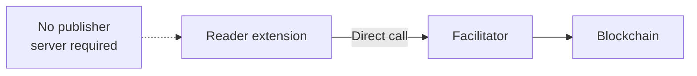
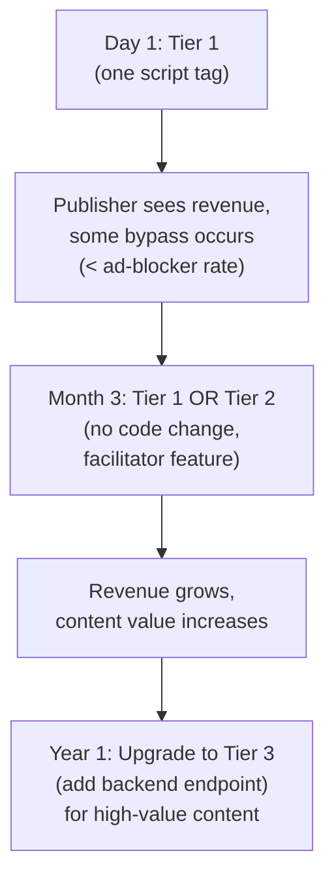

# Design Decisions

This document explains the **why** behind Paperwall's architecture. For the technical **what/how**, see [architecture.md](architecture.md).

## Table of Contents

1. [The Problem We're Solving](#the-problem-were-solving)
2. [Progressive Trust Tiers](#progressive-trust-tiers)
3. [Progressive Adoption Path](#progressive-adoption-path)
4. [Why Not Start with Tier 3 Only?](#why-not-start-with-tier-3-only)
5. [Extension Works in All Modes](#extension-works-in-all-modes)
6. [Browser Extension: Intentionally a Pseudo-Wallet](#browser-extension-intentionally-a-pseudo-wallet)
7. [Agent: Wallet Encryption and Storage](#agent-wallet-encryption-and-storage)
8. [Optimistic Settlement: Default-On for Tier 1 & 2](#optimistic-settlement-default-on-for-tier-1--2)
9. [Cross-Browser Extension: Architecture Decisions](#cross-browser-extension-architecture-decisions)
10. [Multi-Network Support](#multi-network-support)
11. [Auto-Pay: Budget-Controlled Automatic Micropayments](#auto-pay-budget-controlled-automatic-micropayments)
12. [Other Design Decisions](#other-design-decisions)

---

## The Problem We're Solving

**Target publishers:** Small-to-medium content creators currently using ad-supported models (blogs, independent journalism, niche magazines). They're losing 20-40% of revenue to ad-blockers.

**Barrier to adoption:** These publishers:
- Don't have backend development resources
- Use static site generators (Hugo, Jekyll, 11ty)
- Rely on platforms without server control (Medium, Substack, WordPress.com)
- Can't justify infrastructure investment for a payment experiment

**Traditional x402 (server mode)** requires:
- Backend endpoint to verify/settle payments
- Database to track payment state
- Server maintenance and monitoring
- Integration with existing CMS/platform

For a publisher charging **$0.01 per article**, this overhead is prohibitive. They need to process 1,000 payments just to cover one hour of developer time.

---

## Progressive Trust Tiers

### The Client-First Design Choice

Paperwall's default payment flow (Tier 1) is **unusual** compared to traditional web payments and even standard x402 flow, where the server calls the payment processor with a secret API key:


```mermaid
graph LR
    A["Reader"] -->|"Submit form"| B["Publisher server"]
    B -->|"Secret API key"| C["Payment processor"]
    C --> D["Blockchain/Bank"]
```

Paperwall Tier 1 inverts this: the **reader's browser extension** calls the facilitator directly, with no server involvement:


```mermaid
graph LR
    A["Reader extension"]
    B["Facilitator"]
    C["Blockchain"]
    D["No publisher<br/>server required"]

    A -->|Direct call| B
    B --> C
    D -.-> A
```

This is a **deliberate design decision** driven by our primary use case and adoption goals. It allows Paperwall to offer **three tiers** with increasing trust but also increasing complexity:

### Tier 1: Client Mode (MVP)

**Who calls facilitator:** Reader's extension
**Publisher setup:** One `<script>` tag
**Backend required:** No
**Trust model:** Honor system (client-side)

The extension handles the entire payment flow:
1. Detects payment signal from SDK
2. Shows payment prompt to reader
3. Signs EIP-712 authorization
4. Calls facilitator `/settle` endpoint
5. Notifies SDK of success
6. SDK triggers publisher's callback (hide ads)

**Security trade-off:** A malicious extension could forge a "success" message to the SDK without actually paying. This is **equivalent to installing an ad-blocker** — the reader bypasses monetization, but they can't steal funds or harm others.

**Why this is acceptable:**
- **Ad-blocker equivalence:** 20-40% of readers already bypass ads. A technical reader forging payments is no worse than the status quo.
- **Micropayment economics:** For $0.01 articles, the cost of enforcement exceeds the value protected.
- **Honest majority:** Most readers are honest (just like donation-based models work).
- **No financial loss:** The worst case is lost revenue, not stolen funds (the payment either happens or it doesn't — there's no chargeback fraud risk).

**Who this serves:**
- Static site publishers
- WordPress.com / Substack / Medium users (no backend control)
- Publishers experimenting with micropayments
- Content worth $0.01-$0.10 per page where bypass risk = ad-blocker risk

### Tier 2: Client Mode with Signed Receipts (Phase 1)

**Who calls facilitator:** Reader's extension
**Publisher setup:** Same `<script>` tag (no code change)
**Backend required:** No
**Trust model:** Cryptographically verified receipts

The facilitator returns a **signed receipt** after settlement. The SDK verifies:
1. Receipt signature is valid (facilitator's public key)
2. `receipt.payTo` matches SDK config
3. `receipt.amount` matches SDK config

A malicious extension **cannot forge** a valid signature because it lacks the facilitator's private key. It can only:
- Block payment (don't forward receipt) → publisher never grants access → no harm
- Redirect payment (change payTo) → facilitator signs with real payTo → SDK rejects mismatch → no harm

**Why this matters:**
- **Cryptographic proof:** Publishers have auditable evidence that payment occurred
- **No backend required:** Still a single script tag
- **Same latency:** Signature is returned with settlement (no extra round-trip)

**Who this serves:**
- Medium-value content ($0.25-$1.00)
- Publishers who need payment records for accounting
- Platforms where "pay once, share the callback" attacks are a concern

### Tier 3: Server Mode (Phase 1+)

**Who calls facilitator:** Publisher's server
**Publisher setup:** Script tag + backend endpoint
**Backend required:** Yes
**Trust model:** Full server-side verification

The extension collects the reader's signature but **does not call the facilitator**. Instead:
1. Extension returns signature to SDK
2. SDK forwards signature to publisher's server (`data-payment-url`)
3. **Publisher's server** calls facilitator `/verify` + `/settle` with secret API key
4. Publisher's server decides whether to grant access
5. Publisher's server returns result to SDK
6. SDK notifies extension (for UI/history update)

This is **standard x402 server-side flow**. The extension is just the wallet UX; the publisher controls settlement.

**Why this matters:**
- **Hard paywalls:** Content never sent to browser until payment verified
- **Server-side access control:** Integrate with existing auth systems
- **No client-side bypasses:** Technical readers cannot inspect source or forge callbacks
- **Audit logs:** Full server-side payment tracking

**Who this serves:**
- High-value content ($5+, subscriptions)
- Publishers with existing backend infrastructure
- Cases requiring server-side access control (API keys, downloads, premium features)

---

## Progressive Adoption Path

The three-tier model allows publishers to **start simple and upgrade as needed**:


```mermaid
graph TD
    A["Day 1: Tier 1<br/>(one script tag)"]
    B["Publisher sees revenue,<br/>some bypass occurs<br/>(< ad-blocker rate)"]
    C["Month 3: Tier 1 OR Tier 2<br/>(no code change,<br/>facilitator feature)"]
    D["Revenue grows,<br/>content value increases"]
    E["Year 1: Upgrade to Tier 3<br/>(add backend endpoint)<br/>for high-value content"]

    A --> B --> C --> D --> E
```

**Key insight:** Publishers charging $0.01/article don't need the same security as publishers charging $120/year. The architecture **must not force all publishers to the highest security tier** just to experiment with micropayments.

---

## Why Not Start with Tier 3 Only?

If Paperwall only supported server mode (Tier 3):
- ❌ Static site publishers excluded (no backend to call facilitator)
- ❌ Small publishers can't experiment (infrastructure investment required upfront)
- ❌ High friction blocks adoption (most publishers give up before seeing revenue)
- ❌ Over-engineering for micropayments (security complexity exceeds value protected)

By offering **Tier 1 as the default**, we:
- ✅ Enable experimentation with zero infrastructure cost
- ✅ Reach publishers who can't run backend services
- ✅ Prove the micropayment model works before publishers invest in infrastructure
- ✅ Allow revenue-driven upgrades (start simple, upgrade when economics justify it)

---

## Extension Works in All Modes

The Paperwall extension provides the same reader experience in all three tiers:
1. Detects paywall signal
2. Shows payment prompt
3. Signs EIP-712 authorization
4. Handles payment flow (Tier 1 & 2) OR returns signature to SDK (Tier 3)
5. Updates UI, history, and balance

**The extension is always the reader's wallet interface.** The tier determines who calls the facilitator and how trust is verified. This separation allows the same extension to support publishers at all trust levels.

---

## Browser Extension: Intentionally a Pseudo-Wallet

### The Design Choice

Paperwall is **deliberately not** a general-purpose crypto wallet. We don't support:
- ❌ Transferring funds to other addresses
- ❌ Swapping tokens
- ❌ Managing NFTs or multiple assets
- ❌ Connecting to dApps via WalletConnect
- ❌ Importing existing wallets

This is not a feature gap — it's a **core design principle**.

### Why We Build a Limited Wallet

#### 1. Security Through Segregation

**Users must never use their main wallet for micropayments.**

- A wallet holding $5-20 for article payments should be **completely separate** from a wallet holding life savings
- If a malicious publisher tricks a user into overpaying, the blast radius is limited to the small balance
- Lost password = lost $10, not $10,000
- This segregation pattern is **fundamental to micropayment safety**

By making Paperwall a dedicated wallet, we enforce this best practice by design. Users can't accidentally expose their primary wallet to every blog they read.

#### 2. Simpler Security Model

**Small balances justify simpler security.**

Because Paperwall wallets hold small amounts ($5-50), we can:
- ✅ Skip passkeys/hardware wallet requirements
- ✅ Skip multi-factor authentication for every transaction
- ✅ Use password-only encryption (600k PBKDF2 iterations)
- ✅ Allow instant payments without confirmation prompts

If we were building a general wallet holding thousands of dollars, we'd need biometric auth, hardware security modules, social recovery, etc. For micropayments, that complexity **hurts usability more than it helps security**.

The security model matches the threat model: protect $20, not $20,000.

#### 3. The Grandma Test (KISS Principle)

**The extension should be so easy to use that even my grandma can use it.**

A general crypto wallet has:
- Gas fees to explain
- Token approval flows
- Network switching
- Transaction speed vs cost trade-offs
- Address formats (EVM vs non-EVM)
- Seed phrase backup ceremonies

Paperwall has:
- Set a password
- Click "Approve Payment"
- That's it

**Keep It Simple, Stupid.** Every feature we don't add is complexity we don't inflict on users.

#### 4. Blockchain as Invisible Infrastructure

**Users don't know what a mainframe is. They shouldn't need to know what a blockchain is.**

When you use a credit card:
- You don't think about ACH networks, interchange fees, or ISO 8583 messages
- You swipe/tap and it works

When you use Paperwall:
- You shouldn't think about gas, nonces, EIP-712, or chain IDs
- You click "Pay $0.05" and it works

**Blockchain is a payment technology, not an identity.** Our goal is to make crypto payments feel like normal payments. Exposing wallet features (swaps, transfers, dApp connections) would reinforce the "this is crypto" framing instead of "this is a micropayment tool."

### Future Vision: Transparent Payment Tech

As Paperwall evolves, we're moving **further away** from traditional crypto wallet UX:

- **Fiat onramps** — Users top up with credit cards, never see "USDC" or "bridging"
- **Auto-refill** — Balance drops below $5? Charge $10 to card automatically
- **Spending reports** — "You spent $3.42 on articles this month" (not "0.0034 ETH gas + 3.42 USDC")
- **No seed phrases** — Cloud backup with email recovery (controversial in crypto, normal everywhere else)

We're building a **payment tool that happens to use blockchain**, not a **blockchain tool that happens to enable payments**.

### What This Means for Developers

When adding features, ask:
- **Does my grandma need this?** If not, cut it.
- **Does this expose blockchain internals?** If yes, abstract it or cut it.
- **Would this feature tempt users to hold more funds?** If yes, reconsider.
- **Is this a standard wallet feature?** If yes, we probably don't need it.

Paperwall's scope is: **pay for content, check balance, view history.** Anything beyond that needs strong justification.

---

## Agent: Wallet Encryption and Storage

The agent supports three encryption modes and two storage backends, each designed for a specific deployment scenario:

### Encryption modes (for file-based storage)

| Mode | Key derivation | Use case |
|------|---------------|----------|
| **Machine-bound** | PBKDF2(hostname + uid + salt) | Local development, stable machines, no keychain available |
| **Password** | PBKDF2(user password + random salt) | MCP CLI, interactive terminals, portable wallets |
| **Environment-injected** | Base64-decoded `PAPERWALL_WALLET_KEY` | Containers, K8s, CI/CD |

**Recommended defaults for file-based storage:** The `paperwall setup` wizard offers a choice. Machine-bound is the recommended fallback when an OS keychain is unavailable (no TTY, no human -- setting PAPERWALL_PASSWORD in .bashrc would be plaintext next to the encrypted file, so machine-bound encryption provides equivalent protection with zero friction). Password mode is best for interactive MCP usage (Claude Code, Cursor) where portability and explicit user intent matter.

**Why password mode:** MCP usage (Claude Code, Cursor) is interactive, so password prompts are acceptable. Password mode makes the wallet portable across machines and gives explicit user control.

**Why environment-injected:** A2A server deployments in containers need deterministic key derivation across pod instances. All pods with the same `PAPERWALL_WALLET_KEY` can decrypt the same wallet file.

### OS keychain storage

The agent can store private keys in the OS native credential manager (macOS Keychain, GNOME Keyring, Windows Credential Manager) via the `@napi-rs/keyring` optional dependency. The `paperwall setup` wizard presents this as the **recommended** option when the keychain is available, with machine-bound encryption as the recommended fallback for headless or containerized environments.

**Why a separate storage backend (not an encryption mode):** The keychain is a WHERE (storage location), not a HOW (encryption method). The OS keychain provides its own protection -- adding PBKDF2 encryption on top would be redundant. This distinction keeps the `EncryptionMode` interface clean: encryption modes define key derivation for file-based storage, while keychain is an orthogonal storage choice.

**Why optional dependency:** `@napi-rs/keyring` includes native binaries that may not compile on all platforms. Making it optional means the agent works everywhere (file-based storage is always available), with keychain as an enhancement on supported desktops.

**Trade-offs:** Keychain is unavailable in headless/container environments. The key is stored in plaintext within the OS credential store (protected by OS-level access control, not by Paperwall's own encryption).

---

## Optimistic Settlement: Default-On for Tier 1 & 2

### The Design Choice

Paperwall delivers content to the reader **immediately after signing**, before blockchain settlement confirms. Settlement continues in the background. If it fails, the reader is notified. This is the default behavior for Tier 1 and Tier 2 — publishers must explicitly opt out with `data-optimistic="false"`.

### Why This Is the Default

#### 1. Latency Is the Enemy of Micropayments

On-chain settlement on SKALE takes 1-5 seconds. For a $0.01 article payment, making the reader wait for blockchain confirmation is absurd — it's like waiting for ACH clearance before reading a newspaper. The perceived value of the content doesn't justify the wait.

**Traditional flow:** Sign → Settle (1-5s) → Deliver content
**Optimistic flow:** Sign → Deliver content immediately → Settle in background

The optimistic flow removes the critical-path latency entirely. The reader experiences instant access.

#### 2. Command-Query Responsibility Segregation (CQRS)

The insight behind optimistic settlement is a CQRS-style separation: **reading content** and **settling payment** are independent operations that don't need to be coupled.

- **Command (write):** "Transfer 10000 USDC from reader to publisher" — this is the settlement, it's async and eventually consistent.
- **Query (read):** "Show me the article" — this can happen immediately once the reader has demonstrated intent to pay (by signing).

The signing step proves the reader authorized payment. The on-chain transfer is just execution of that authorization. There's no reason to block content delivery on execution when the authorization is already cryptographically committed.

#### 3. Risk Analysis Favors the Reader

For micropayments ($0.01-$1.00), the risk of optimistic delivery is asymmetric:

| Scenario | Probability | Impact |
|----------|------------|--------|
| Settlement succeeds | >99.9% | Normal flow, everyone happy |
| Settlement fails (network issue) | <0.1% | Reader saw a $0.01 article for free. Publisher lost $0.01. |
| Settlement fails (insufficient funds) | Near zero (pre-flight balance check) | Same as above |

The expected loss is fractions of a cent per thousand transactions. The UX gain (instant access for every reader, every time) vastly outweighs this risk.

#### 4. Consistency with Existing Payment Models

Real-world payment systems already use optimistic patterns:

- **Credit cards:** You get your coffee immediately. Settlement happens in 2-3 business days.
- **Tap-to-pay:** Offline mode authorizes up to $250 without contacting the bank.
- **Ride-sharing:** You exit the car before the charge clears.
- **App stores:** Downloads start before payment processor confirms.

Paperwall's optimistic settlement follows the same principle: **authorize first, settle asynchronously**.

### Why Not Default-On for Tier 3?

Tier 3 (server mode) publishers control the flow themselves. Their backend decides when to release content. Optimistic delivery doesn't apply because:
- The publisher's server calls `/settle`, not the extension
- Content is gated server-side, not client-side
- High-value content ($5+) justifies the wait for confirmation
- The publisher may need the transaction hash for access control or audit purposes

### Recovery and Safety

Optimistic settlement includes safety mechanisms:

- **Pre-flight balance check:** Before signing, the extension verifies the reader has sufficient funds. This eliminates the most common failure mode.
- **Background settlement tracking:** Pending settlements are stored in `chrome.storage.session` and recovered if the service worker restarts (`recoverPendingPayments()`).
- **Status updates:** The SDK receives `PAYMENT_CONFIRMED` or `PAYMENT_SETTLE_FAILED` messages after background settlement completes, allowing publishers to react (e.g., re-gate content on failure).
- **Agent flush:** The CLI agent calls `flushPendingSettlements()` before process exit to ensure in-flight settlements complete.

### Publisher Opt-Out

Publishers who need confirmed settlement before content delivery can set `data-optimistic="false"`:

```html
<script src="https://cdn.jsdelivr.net/npm/@paperwall/sdk/dist/index.iife.js"
  data-optimistic="false"
  ...other attributes...
></script>
```

This reverts to the standard sequential flow: sign → settle → deliver. Use this when:
- Content has high per-view value and settlement failure is unacceptable
- You need the transaction hash before granting access
- Your business model requires confirmed payment (e.g., one-time downloads)

---

## Cross-Browser Extension: Architecture Decisions

When the extension was ported from Chrome-only to Firefox and Edge, four design decisions were made. All browser differences are resolved at the build and manifest layer — no runtime `if (browser === 'firefox')` branching exists in application code.

### Single Source, Dual Packaging

**Decision:** One TypeScript source tree produces two packaged artifacts: a `.zip` for Chrome and Edge, and an `.xpi` for Firefox.

**Why not separate forks or separate manifests:** The differences between Chrome and Firefox are exactly four specific points (one application code line, two manifest keys, one build format setting). A fork doubles the maintenance surface for every future bug fix and feature. Separate `manifest.chrome.json` / `manifest.firefox.json` files require keeping two files in sync for changes that are additive — Firefox keys are silently ignored by Chrome, so a single manifest with both key sets is simpler and less error-prone.

**Trade-off accepted:** The build pipeline produces two output directories and two packaging steps. All application code remains identical across all three browsers.

### Self-Contained Bundle for the Background Script

**Decision:** The background entry point compiles from ESM to a self-contained (IIFE) bundle for all targets. The `"type": "module"` field is removed from the manifest.

**Why:** Chrome service workers accept both module and classic scripts. Firefox's `background.scripts` context (the fallback for MV3 on Firefox) does not document support for module-format scripts. A self-contained bundle — where all dependencies are concatenated into a single immediately-invoked scope — works correctly in both execution environments without any conditional logic.

**Why not module format on both:** There is no benefit to module format for an extension background script. It runs as a singleton and is never imported by other modules. The popup and content script bundles already use the self-contained format and require no change.

### Native `chrome.*` Namespace (No Polyfill)

**Decision:** All existing `chrome.*` API calls remain unchanged. `webextension-polyfill` is not introduced.

**Why:** Firefox supports the `chrome.*` namespace as a complete alias for its `browser.*` namespace. Every API Paperwall uses — `chrome.storage`, `chrome.runtime`, `chrome.tabs`, `chrome.action` — is confirmed compatible on Firefox via this alias. The polyfill adds a dependency, requires changes to every entry point, and replaces `@types/chrome` across all TypeScript sources — none of which produces any user-visible benefit.

**Future consideration:** If the codebase later migrates to async/await-native extension APIs or if Safari support is added (which does not fully alias `chrome.*`), revisiting this decision is appropriate.

### Runtime Origin Verification (No Hardcoded Scheme)

**Decision:** The background message router derives the extension's base URL from the runtime API rather than constructing it from a hardcoded `chrome-extension://` scheme string.

**Why:** The message router enforces a trust boundary — it only processes privileged operations (`CREATE_WALLET`, `UNLOCK_WALLET`, `SIGN_AND_PAY`, `GET_BALANCE`, `EXPORT_PRIVATE_KEY`, etc.) from messages sent by the extension's own popup. The original check was `sender.url.startsWith('chrome-extension://${chrome.runtime.id}/')`. Firefox assigns `moz-extension://` to extension resources, so this check silently rejected every privileged popup message on Firefox, making the extension completely non-functional.

**Why the runtime-derived value is better, not just correct:** The runtime API returns the canonical base URL the browser itself uses when loading extension pages. This means the check value and the assigned URLs are generated by the same source — making origin verification correct on any browser by construction, and impossible for page content to predict or spoof.

**One-line change:** `src/background/message-router.ts` — the string `'chrome-extension://${chrome.runtime.id}/'` is replaced with `chrome.runtime.getURL('')`. The intent and scope of the check are identical.

---

## Multi-Network Support

### The Decision

Paperwall supports four networks: SKALE Testnet (`eip155:324705682`), Base Sepolia (`eip155:84532`), SKALE Mainnet (`eip155:1187947933`), and Base Mainnet (`eip155:8453`). Publishers declare which networks they accept; the extension and agent auto-select the best one for each payment.

### Why These Four Networks

**SKALE** was the original choice: EVM-compatible, ultra-low fees, making $0.01 transactions viable. Adding **Base** (Coinbase's L2) gives readers an on-ramp they may already have funds on via Coinbase and Coinbase Wallet.

Having testnet and mainnet variants of both chains means:
- Developers test end-to-end with free funds on a realistic stack
- Publishers can accept mainnet payments without requiring readers to bridge to an unfamiliar chain

### Priority Order Rationale

The auto-selection priority is: SKALE Testnet → Base Sepolia → SKALE Mainnet → Base Mainnet.

- **Testnets first:** during development and testing, testnet should be used preferentially to avoid accidentally spending real money. If a wallet has funds on both testnet and mainnet, testnet wins.
- **SKALE before Base within each tier:** SKALE has lower per-transaction fees than Base. All else equal, the cheaper network is preferred.
- **Priority is a tiebreaker, not a veto:** if the reader has a sufficient balance only on Base Mainnet, that network is used — regardless of priority.

### Two-Tier Balance Cache

The extension caches balances per network with a short TTL (a few seconds) to avoid making four RPC calls on every payment prompt. The cache is keyed by `(address, networkId)` so stale balance data for one network does not invalidate the others. This allows the multi-network balance display in the popup to be fast while still reflecting recent top-ups.

### Why Network Selection Is Duplicated in Extension and Agent

The extension (browser) and agent (Node.js CLI/server) both implement network selection independently rather than sharing a package.

**The constraint:** sharing runtime logic between a Chrome extension (MV3 service worker, Web Crypto API, `chrome.*` APIs) and a Node.js process requires a package that works cleanly in both environments. At the time of implementation, the added packaging complexity of a shared `@paperwall/core` package was not justified for a ~50-line selection function.

**The trade-off accepted:** the priority order and selection logic must be kept in sync manually. The logic is simple (sort by priority, filter by sufficient balance), well-tested in each package separately, and unlikely to diverge in practice. If the selection logic grows substantially (e.g., fee estimation, latency probing), extracting a shared package is the right next step.

---

## Auto-Pay: Budget-Controlled Automatic Micropayments

### The Problem

Paperwall users must manually approve every micropayment via the extension popup, even for sites they visit daily. A reader consuming 20 articles/day across trusted sites spends 60–100 seconds on repetitive approve clicks. This creates **approval fatigue** where the cognitive burden of each approval exceeds the payment value ($0.01–$0.10), leading to abandonment or habitual rejection.

The irony: the extension successfully reduced payment friction from "enter credit card details" to "click approve," but for daily readers, even a single click per article is too much.

### The Design Choice

Auto-pay allows the extension to automatically approve payments for **explicitly trusted sites** within **user-defined budget limits**. Three interlocking controls protect the user:

1. **Per-site trust** — every site must be individually approved via "Pay & Auto-approve"
2. **Per-site monthly budget** — caps spending on any single site (default $0.50/month)
3. **Global daily and monthly limits** — caps total auto-pay spending across all sites (default $2.00/day, $20.00/month)

All three must pass for a payment to proceed automatically. If any check fails, the user sees a manual payment prompt with context about why auto-pay was paused.

### Why Per-Site Trust, Not Global Auto-Pay

The simplest approach would be "auto-pay any Paperwall site up to a global limit." We rejected this because:

- A user browsing casually could hit dozens of Paperwall sites and drain their wallet without realizing it
- There is no opportunity for the user to evaluate a site before committing money to it
- It removes the deliberate consent that makes micropayments feel safe

Per-site trust ensures that auto-pay is always the result of an explicit user decision. A site the user has never visited cannot silently extract payments. Rate limiting (max 5 auto-payment attempts per origin per 60-second window) provides an additional safeguard against rapid-fire payment attempts from any single origin.

### Why a Separate Budget Tab (Not Settings)

Budget management could live as a sub-section of Settings. We chose a dedicated tab because:

- **Frequency of access** — users check spending regularly, not just when configuring. Burying budget info in Settings reduces visibility.
- **Primary interaction surface** — budget is not a "set once" configuration. Users edit site budgets, review progress bars, and manage their denylist as part of normal usage.
- **Popup real estate** — five tabs fit comfortably in the 360px popup width. The marginal cost of a fifth tab is near zero.

### Why Daily + Monthly Limits (Not Lifetime)

Research showed that daily + monthly limits match how people think about budgets. A "lifetime cap" was considered but rejected:

- Users can always add more funds to their wallet, making a lifetime cap arbitrary
- The wallet balance itself serves as the effective lifetime cap
- Daily limits prevent single-day drain (e.g., binge-reading 50 articles)
- Monthly limits align with subscription-era mental models

### Why Price-Tier Trust

When a user clicks "Pay & Auto-approve," the extension records the current price as the maximum per-transaction amount for that site. If the site later increases its price above this threshold, auto-pay pauses and shows a manual prompt explaining the price change.

Without this, a publisher could set a $0.01 price to earn trust, then silently raise it to $0.10 — a 10x increase that would drain budgets faster than expected. Price-tier trust ensures the user's original consent is bounded.

### Why Lazy Period Resets

Budget periods (daily and monthly) reset **lazily** — not on a timer, but on the next payment attempt after the period has elapsed. This avoids:

- Needing the `alarms` permission (which requires justification in Chrome Web Store review)
- Background wake-ups that consume battery and resources
- Complexity of timer management across service worker restarts

The trade-off is that a user checking the Budget tab mid-period sees stale "spent" values until the next payment triggers a reset. In practice, this is invisible — the reset happens before the budget check, so no payment is incorrectly blocked or allowed.

### Why Atomic Check-and-Deduct

The TRD requires that budget checking and deduction happen in a single read-modify-write cycle. Without this, two tabs loading simultaneously could both pass the budget check before either deducts, causing both payments to proceed and the budget to be exceeded.

The service worker is single-threaded but uses `await`, so interleaving is possible between the budget read and the storage write. The `checkAndDeduct` function reads rules, evaluates the 11-step decision chain, deducts if eligible, and writes back — all before yielding to the event loop. If the payment subsequently fails, `refundSpending` restores the deducted amount.

### Why No Optimistic Signal on First Visit

The extension never sends an optimistic payment signal to a publisher on the user's first visit. Optimistic flow tells the publisher "content will be unlocked" — but if the user then rejects the prompt, the publisher must awkwardly re-gate content that was already shown. For trusted sites, optimistic flow is safe because auto-pay will proceed (within budget). For unknown sites, the prompt must come first.

### Why HTTPS-Only and Origin Validation

Auto-pay makes payments **without user confirmation**, which changes the threat model. A manual "click approve" prompt gives the user a chance to spot a suspicious site. Auto-pay removes that checkpoint, so the extension must compensate with automated security checks.

**The core threat: spoofing.** An attacker could create a fake version of a trusted publisher site and trick the user's extension into auto-paying. Three attack vectors were identified:

1. **HTTP man-in-the-middle** — An attacker on the same network intercepts an HTTP page and injects or modifies the payment meta tag, redirecting micropayments to an attacker-controlled address. The user sees the legitimate publisher's content while paying the attacker.
2. **Localhost/private IP** — A locally-served phishing page at `http://localhost:3000` or `http://192.168.1.1` presents a fake publisher UI and triggers auto-payments.
3. **Exotic URI schemes** — `file://`, `data:`, and `blob:` URIs can render arbitrary HTML with payment signals, bypassing external security scanning.

**The decision: defense in depth across three layers.**

The extension validates payment origins at three independent points. A bypass at any single layer does not compromise the system:

| Layer | Location | What it checks |
|-------|----------|---------------|
| Content script | `content/index.ts` | `window.location.protocol === 'https:'` — non-HTTPS pages never trigger detection |
| Bridge | `content/bridge.ts` | Rejects `file:`, `data:`, `blob:`, `javascript:` schemes |
| Service worker | `message-router.ts` | Cross-verifies message origin against browser-verified `sender.tab.url` |
| Decision engine | `auto-pay-rules.ts` | `validatePaymentOrigin()` blocks non-HTTPS, private IPs, malformed URLs |

**Why full block on HTTP, not just disable auto-pay:** We considered allowing manual payment prompts on HTTP sites while only blocking auto-pay. We rejected this because no legitimate publisher serves over HTTP in 2026, and showing a payment prompt on an HTTP page normalizes an unsafe interaction pattern. If a user sees "Pay $0.05 to example.com" on an HTTP page, they may click approve without realizing the page is spoofed.

**Why cross-verify against `sender.tab.url`:** Content scripts run in the page context and their data could theoretically be manipulated. The `sender.tab.url` property is populated by the browser runtime itself and cannot be spoofed by the content script. By comparing the message's `origin` field against `new URL(sender.tab.url).origin`, the service worker independently confirms the payment request comes from the claimed site.

**Why reuse the facilitator's private IP detection:** The `isPrivateIP()` function was already battle-tested in `facilitator.ts` to prevent SSRF attacks against the facilitator URL. Rather than writing a second implementation, we extracted it to `shared/origin-security.ts` and applied the same checks to page origins. This covers localhost, 127.0.0.0/8, RFC 1918 ranges, link-local, IPv6 loopback, and IPv4-mapped IPv6 addresses.

### Why Rate Limiting in the Decision Engine

Budget limits cap **total spending** but don't prevent **rapid individual payments**. A malicious page could fire payment signals in a tight loop, making dozens of $0.001 payments per second within the daily budget. Each payment is individually small, but the rapid pace prevents the user from noticing or reacting.

The rate limiter caps auto-pay at **5 attempts per origin per 60-second window**. It runs as Step 1 in the decision chain (after origin validation, before denylist). It's in-memory (resets on service worker restart) because budget limits are the durable safety net — the rate limiter is burst protection, not a spending cap.

**Why 5 per minute:** Normal reading pace produces 1-3 page loads per minute. 5 gives headroom for fast browsing and tabbed reading while catching automated abuse (which would attempt hundreds per minute).

**Why not only rate limit auto-pay successes:** The rate limiter counts all requests, including those that would be blocked downstream (e.g., denylisted sites). This is intentional — a malicious page has no way to avoid incrementing the counter, and the 60-second window is short enough that legitimate use is unaffected.

### Why EIP-55 Address Validation

The `payTo` address in the payment signal comes from the publisher's meta tag — it's publisher-controlled input that enters the extension unsanitized. A typo or manipulation in the address could send funds to the wrong destination. EIP-55 checksum validation (via `viem/getAddress`) catches malformed addresses before signing.

### Why Normalize Origins Before Matching

Origins from `window.location.origin` are already normalized by the browser (lowercase scheme + host, no trailing slash). However, origins could enter the system through other paths (popup UI, future API). Normalizing all origins (lowercase + strip trailing slash) before storage lookups ensures consistent matching regardless of how the origin was provided. Without this, a user could trust `https://example.com` but the extension could fail to match `https://Example.Com` — a silent budget-tracking bypass.

### What We Explicitly Deferred

- **Auto-trust new sites up to a limit** — effectively makes every site auto-approved; too risky for v1
- **Cross-device budget sync** (`chrome.storage.sync`) — rate limits and security concerns
- **Time-based trust decay** (auto-remove sites after 90 days inactive) — nice-to-have for v2
- **Attention-weighted allocation** (Brave/Flattr model) — Paperwall uses explicit per-article pricing
- **Export/import budget configuration** — deferred to v2
- **Homoglyph/punycode detection** — client-side detection of lookalike domains (e.g., `examp1e.com` vs `example.com`); can be added without architectural changes
- **Community domain blocklist** — MetaMask-style shared blocklist of known malicious domains; requires external service
- **Dev mode for localhost** — toggle in Settings > Advanced for publisher testing on localhost; developers can use HTTPS localhost with valid certs for now

---

## Other Design Decisions

*(Space for future ADRs: file-based storage vs database, etc.)*
