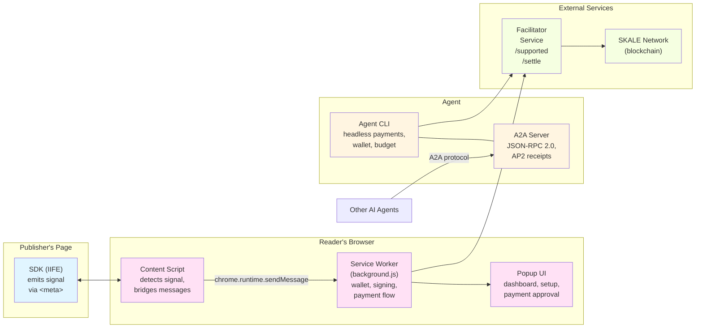

# Developer guide

This guide covers everything you need to understand, build, test, and contribute to Paperwall. It assumes familiarity with TypeScript, Node.js, and browser extension development.

---

## Architecture overview

Paperwall is a micropayment system with four components and an A2A server mode:



**SDK** (publisher side): Emits an `x402-payment-required` meta tag and a `PAPERWALL_PAYMENT_REQUIRED` postMessage signal. Tiny IIFE bundle (~5 KB) with zero runtime dependencies.

**Content Script**: Detects the meta tag via DOM scanning and MutationObserver. Bridges postMessage events from the page to the service worker via `chrome.runtime.sendMessage`.

**Service Worker** (background.js): The core of the extension. Manages the encrypted wallet, handles message routing, creates signed payment payloads via the x402 library (`@x402/evm`), communicates with the facilitator service, and tracks payment history.

**Popup UI**: Renders screens based on wallet state -- setup (create wallet), unlock (enter password), dashboard (balance, address, history), and payment prompt (approve/reject).

**Facilitator Service**: External service at `https://gateway.kobaru.io`. Provides EIP-712 domain info (`/supported`), verifies signatures (`/verify`), and submits on-chain transactions (`/settle`). Not part of this repo.

**Agent CLI**: Standalone Node.js CLI that replicates the extension's payment flow for programmatic/headless use. Includes wallet management, budget controls, payment history, and an A2A (Agent-to-Agent) server mode that exposes the payment engine to other AI agents via the A2A protocol (JSON-RPC 2.0).

For a detailed architecture deep dive, see [architecture.md](architecture.md).

---

## Repository structure

```
paperwall/
  package.json              # Workspace root, npm workspaces config
  packages/
    sdk/                    # Publisher SDK
      src/
        index.ts            # Entry point, Paperwall.init() and autoInit()
        config.ts           # Config parsing and validation
        signal.ts           # <meta> tag emission (x402-payment-required)
        messaging.ts        # postMessage bridge (SDK <-> content script)
        badge.ts            # Visual badge (bottom-right corner)
        types.ts            # TypeScript interfaces
      __tests__/            # Vitest unit tests
      tsup.config.ts        # Builds ESM, CJS, and IIFE bundles
      dist/
        index.iife.js       # IIFE bundle for <script> tag usage (~5 KB)
        index.js             # ESM bundle
        index.cjs            # CJS bundle

    extension/              # Chrome Extension (MV3)
      manifest.json         # Extension manifest
      build.ts              # esbuild-based build script
      src/
        background/         # Service worker
          index.ts          # Entry point, registers message router
          message-router.ts # Central message handler (all types)
          key-manager.ts    # Key generation, PBKDF2+AES-256-GCM encryption
          payment-client.ts # x402 client wrapper (EIP-712 signing via @x402/evm)
          signer.ts         # Standalone EIP-712 signing (not used in main flow)
          facilitator.ts    # HTTP client for facilitator service
          balance.ts        # On-chain USDC balance queries (with cache)
          history.ts        # Payment history (chrome.storage.local)
        content/            # Content script
          index.ts          # Entry point, scans and observes for meta tags
          detector.ts       # DOM scanning + MutationObserver
          bridge.ts         # postMessage <-> chrome.runtime bridge
        popup/              # Extension popup UI
          index.html        # Popup HTML shell
          index.ts          # Popup router (setup/unlock/dashboard/payment)
          styles.css         # Popup styles
          screens/
            setup.ts        # Wallet creation screen
            unlock.ts       # Password entry screen
            dashboard.ts    # Balance, address, history display
            payment.ts      # Payment approval/rejection screen
        shared/             # Shared between background, content, popup
          constants.ts      # Network configs (SKALE testnet/mainnet)
          format.ts         # USDC formatting (smallest unit -> human-readable)
      __tests__/            # Vitest unit tests
      dist/                 # Built extension (load this in Chrome)

    agent/                  # CLI tool + A2A server
      src/
        cli.ts              # Commander-based CLI (fetch, wallet, budget, history, serve, demo)
        payment-engine.ts   # Full x402 payment flow (402, client mode, server mode)
        wallet.ts           # Wallet creation, key resolution, balance checking
        signer.ts           # Standalone EIP-712 signing (not used in main flow)
        facilitator.ts      # Facilitator HTTP client
        budget.ts           # Spending limits (per-request, daily, total)
        history.ts          # JSONL-based payment history
        meta-tag.ts         # HTML meta tag parser
        publisher-client.ts # Server-mode payment submission
        crypto.ts           # PBKDF2+AES-256-GCM (Node.js crypto)
        storage.ts          # File-based storage (~/.paperwall/)
        networks.ts         # Network configs
        output.ts           # JSON stdout output helpers
        logger.ts           # stderr logging
        server/
          index.ts            # Express server + A2A protocol wiring
          executor.ts         # AgentExecutor implementation (A2A SDK interface)
          request-orchestrator.ts  # Wraps fetchWithPayment with AP2 receipt creation
          receipt-manager.ts  # JSONL storage, explorer URLs, pagination
          receipt-viewer.ts   # HTML receipt dashboard
          access-gate.ts      # Bearer token auth with HMAC timing-safe comparison
          agent-card.ts       # A2A Agent Card builder (protocol v0.3.0)
          config.ts           # Server config resolution (CLI > env > file > default)
          demo-client.ts      # AP2 lifecycle demo runner
          types.ts            # Receipt, ServerConfig, context interfaces
          __tests__/          # Server unit tests
      CLAUDE.md             # Agent CLI usage guide for AI assistants

  demo/                     # Demo news site with SDK integration
    index.html              # Homepage with article cards
    articles/               # Article pages with Paperwall script tags
    css/                    # Demo site styles
```

---

## Development setup

### Prerequisites

- **Node.js 18+** (check with `node --version`)
- **npm 9+** (included with Node.js 18+)
- **Chrome 120+** (for extension development)
- **Git** (to clone the repository)

### Installation

```bash
git clone https://github.com/kobaru/paperwall.git
cd paperwall
npm install
```

This installs dependencies for all three packages using npm workspaces.

### Building

Build all packages:

```bash
npm run build
```

Or build individual packages:

```bash
npm run build --workspace=packages/sdk
npm run build --workspace=packages/extension
npm run build --workspace=packages/agent
```

**SDK build** uses tsup to produce three bundles: ESM (`index.js`), CJS (`index.cjs`), and IIFE (`index.iife.js`). The IIFE bundle self-initializes from `data-*` attributes on its own `<script>` tag.

**Extension build** uses esbuild to bundle the service worker (ESM), content script (IIFE), and popup (IIFE). Static files (manifest, HTML, CSS, icons) are copied to `dist/`.

**Agent build** uses tsup to produce a single ESM CLI bundle.

### Loading the extension for development

1. Build the extension: `npm run build --workspace=packages/extension`
2. Open `chrome://extensions` in Chrome
3. Enable "Developer mode" (toggle in top-right)
4. Click "Load unpacked"
5. Select the `packages/extension/dist` directory
6. The extension appears in your toolbar

After making changes, rebuild and click the "Reload" button on `chrome://extensions`.

### Running demos and testing

Paperwall includes multiple demo scenarios to test the full payment workflow. All demos require building the SDK first.

#### Prerequisites

Build all packages before running any demos:

```bash
npm run build
```

This creates the SDK bundle at `packages/sdk/dist/index.iife.js` which is required by the demo site.

---

#### Demo 1: Browser Extension with Demo Site

Test the full user experience with the Chrome extension and a local news site.

**1. Start the demo server:**

```bash
npm run demo
```

Or manually:

```bash
node demo/server.js          # Default port 8080
node demo/server.js 3000     # Custom port
```

**2. Load the extension:**

Follow the [extension loading instructions](#loading-the-extension-for-development) above.

**3. Open the demo site:**

Visit `http://localhost:8080` in Chrome. You'll see "The Daily Paper" homepage with three paywalled articles:

- **Article 1**: "The Rise of Micropayments" ($0.01 USDC)
- **Article 2**: "Zero-Gas Transactions" ($0.01 USDC)
- **Article 3**: "The Ad-Free Web" ($0.01 USDC)

**4. Test the payment flow:**

- Click any article to view it
- The Paperwall extension detects the payment signal
- Extension popup appears: "Pay $0.01 USDC to remove ads?"
- Create wallet (first time) or unlock with password
- Approve payment → ads are removed and thank-you banner appears
- Decline payment → ads remain, no charge

> **Important:** Do not open `demo/index.html` via `file://` -- browser extensions and `postMessage` origin validation require an HTTP origin.

---

#### Demo 2: Agent CLI Fetch

Test headless payments with the agent CLI tool.

**1. Create a wallet (one-time setup):**

```bash
paperwall wallet create
```

**2. Set budget limits:**

```bash
paperwall budget set --per-request 0.10 --daily 5.00 --total 50.00
```

**3. Check your wallet balance:**

```bash
paperwall wallet balance
```

**4. Start the demo server** (if not already running):

```bash
npm run demo
```

**5. Fetch a paywalled article:**

```bash
paperwall fetch http://localhost:8080/articles/article-1.html --max-price 0.05
```

**Expected output (JSON to stdout):**

```json
{
  "ok": true,
  "content": "<!DOCTYPE html>...",
  "payment": {
    "mode": "client",
    "amountFormatted": "0.01",
    "txHash": "0xabc123...",
    "network": "eip155:324705682",
    "token": "0x2e08028E3C4c2356572E096d8EF835cD5C6030bD"
  }
}
```

**6. View payment history:**

```bash
paperwall history
paperwall history --last 5
```

**7. Check remaining budget:**

```bash
paperwall budget status
```

**Exit codes:**
- `0`: Success (content fetched, with or without payment)
- `1`: Operational error (network error, facilitator error, etc.)
- `2`: Payment declined (budget exceeded) — **Do not retry**, increase budget first
- `3`: No wallet configured — Run `wallet create` first

---

#### Demo 3: A2A Server Mode

Test the Agent-to-Agent protocol by running Paperwall as a JSON-RPC server.

**1. Start the A2A server:**

```bash
PAPERWALL_ACCESS_KEYS=demo-key-123 paperwall serve --port 4000
```

The server exposes:
- `/.well-known/agent-card.json` — Agent discovery (public)
- `/rpc` — JSON-RPC 2.0 endpoint (requires Bearer token)
- `/receipts` — HTML receipt viewer (requires Bearer token)
- `/health` — Health check (public)

**2. Discover the agent card:**

```bash
curl http://localhost:4000/.well-known/agent-card.json
```

**Response:**

```json
{
  "name": "Paperwall Agent",
  "protocolVersion": "0.3.0",
  "capabilities": ["message/send"],
  "description": "x402 micropayment agent for paywalled web content",
  "url": "http://localhost:4000"
}
```

**3. Send a JSON-RPC payment request:**

Start the demo server first (`npm run demo` in another terminal), then:

```bash
curl -X POST http://localhost:4000/rpc \
  -H "Authorization: Bearer demo-key-123" \
  -H "Content-Type: application/json" \
  -d '{
    "jsonrpc": "2.0",
    "id": 1,
    "method": "message/send",
    "params": {
      "message": {
        "kind": "message",
        "messageId": "msg-001",
        "role": "user",
        "parts": [{
          "kind": "data",
          "data": {
            "url": "http://localhost:8080/articles/article-1.html",
            "maxPrice": "0.10",
            "agentId": "demo-client"
          }
        }]
      }
    }
  }'
```

**4. View receipts in browser:**

Open `http://localhost:4000/receipts` in your browser (you'll be prompted for the Bearer token).

Filter receipts by stage and date:
- `http://localhost:4000/receipts?stage=settled`
- `http://localhost:4000/receipts?stage=declined`
- `http://localhost:4000/receipts?from=2026-01-01&to=2026-02-01`

---

#### Demo 4: Full AP2 Lifecycle Demo

Run an automated demo that tests the complete Agent Protocol 2 (AP2) payment lifecycle.

**1. Start the A2A server** (in terminal 1):

```bash
PAPERWALL_ACCESS_KEYS=demo-key-123 paperwall serve --port 4000
```

**2. Start the demo site** (in terminal 2):

```bash
npm run demo
```

**3. Run the AP2 demo** (in terminal 3):

```bash
paperwall demo \
  --server http://localhost:4000 \
  --agent-key demo-key-123 \
  --articles \
    http://localhost:8080/articles/article-1.html \
    http://localhost:8080/articles/article-2.html \
    http://localhost:8080/articles/article-3.html \
  --verbose
```

**Expected output (stderr shows progress):**

```
[paperwall demo] Connecting to http://localhost:4000...
[paperwall demo] Discovered: Paperwall Agent (protocol 0.3.0)

[1/3] http://localhost:8080/articles/article-1.html
  ├── Intent: requesting content...
  ├── Authorization: budget check passed
  ├── Settlement: tx 0xabc123def456... on eip155:324705682
  └── Receipt: 12345678... [settled]

[2/3] http://localhost:8080/articles/article-2.html
  ├── Intent: requesting content...
  ├── Authorization: budget check passed
  ├── Settlement: tx 0x789abcdef012... on eip155:324705682
  └── Receipt: 87654321... [settled]

[3/3] http://localhost:8080/articles/article-3.html
  ├── Intent: requesting content...
  ├── Authorization: budget check passed
  ├── Settlement: tx 0x345678abcdef... on eip155:324705682
  └── Receipt: 24681357... [settled]

--- Demo Summary ---
Total requests: 3
Successful: 3
Declined: 0
```

**stdout outputs JSON audit trail:**

```json
{
  "ok": true,
  "summary": {
    "totalRequests": 3,
    "successfulFetches": 3,
    "declinedFetches": 0,
    "explorerLinks": [...]
  },
  "results": [...]
}
```

**What the demo tests:**

- ✅ Agent card discovery via `.well-known/agent-card.json`
- ✅ JSON-RPC message/send method
- ✅ Bearer token authentication
- ✅ Budget enforcement and authorization stage
- ✅ On-chain settlement via facilitator
- ✅ AP2 receipt creation (intent → settled/declined)
- ✅ Receipt persistence to `~/.paperwall/receipts.jsonl`

---

#### Demo Troubleshooting

**Port conflicts:**

If port 8080 or 4000 is already in use:

```bash
node demo/server.js 3000              # Demo site on port 3000
paperwall serve --port 5000     # A2A server on port 5000
```

**Budget exceeded (exit code 2):**

```bash
paperwall budget set --per-request 0.50 --daily 10.00 --total 100.00
```

**No wallet (exit code 3):**

```bash
paperwall wallet create
```

**Insufficient balance:**

Fund your wallet with USDC on SKALE Base Sepolia testnet. See [Network Configuration](#network-configuration) in demo/README.md for faucet links and bridging instructions.

---

## Testing

### Running tests

Run all tests:

```bash
npm test
```

Run tests for a specific package:

```bash
npm test --workspace=packages/sdk
npm test --workspace=packages/extension
npm test --workspace=packages/agent
```

Watch mode:

```bash
npm run test:watch --workspace=packages/sdk
```

### Testing framework

All packages use **Vitest**. Tests are co-located with source files (agent) or in `__tests__/` directories (SDK, extension).

All packages use **Vitest**. Tests are co-located with source files (agent) or in `__tests__/` directories (SDK, extension). 300+ tests across all packages.

### Test organization

**SDK tests** (`packages/sdk/__tests__/`):
- `index.test.ts` -- Paperwall.init() and autoInit() behavior
- `config.test.ts` -- Config parsing and validation
- `messaging.test.ts` -- postMessage handling and timeouts
- `signal.test.ts` -- Meta tag emission and removal
- `badge.test.ts` -- Badge DOM insertion and removal

**Extension tests** (`packages/extension/__tests__/`):
- `message-router.test.ts` -- All message types, auth checks, error paths
- `payment-flow.test.ts` -- Full payment orchestration
- `key-manager.test.ts` -- Key generation, encryption, decryption
- `signer.test.ts` -- EIP-712 signing
- `facilitator.test.ts` -- HTTP client, URL validation, SSRF protection
- `balance.test.ts` -- Balance fetching with caching
- `bridge.test.ts` -- Content script bridge behavior
- `detector.test.ts` -- Meta tag scanning and observation
- `history.test.ts` -- Payment history storage

**Agent tests** (`packages/agent/src/*.test.ts`):
- `cli.test.ts` -- CLI command parsing and output
- `payment-engine.test.ts` -- Full payment flow (402, client, server modes)
- `wallet.test.ts` -- Wallet creation, key resolution
- `budget.test.ts` -- Budget checking and enforcement
- `facilitator.test.ts` -- Facilitator client
- `signer.test.ts` -- EIP-712 signing
- `meta-tag.test.ts` -- HTML meta tag parsing
- `publisher-client.test.ts` -- Server-mode submission
- `crypto.test.ts` -- Encryption/decryption
- `storage.test.ts` -- File storage
- `balance.test.ts` -- Balance queries
- `history.test.ts` -- JSONL history
- `networks.test.ts` -- Network config

**A2A Server tests** (`packages/agent/src/server/__tests__/`):
- `server.test.ts` -- Express server setup and route wiring
- `executor.test.ts` -- AgentExecutor message handling
- `request-orchestrator.test.ts` -- Payment orchestration and receipt creation
- `receipt-manager.test.ts` -- JSONL storage and filtering
- `receipt-viewer.test.ts` -- HTML receipt rendering
- `access-gate.test.ts` -- Bearer token auth and timing-safe comparison
- `agent-card.test.ts` -- Agent Card builder
- `config.test.ts` -- Config resolution precedence
- `demo-client.test.ts` -- Demo runner output formatting

### Type checking

```bash
npm run lint
```

This runs `tsc --noEmit` for the SDK and extension packages.

---

## Key technical decisions

### Why SKALE network?

SKALE has ultra-low fees at the network level, making transactions nearly free for the end user. This is critical for micropayments: a $0.01 payment is worthless if it costs $0.05 in gas. SKALE makes sub-cent transactions economically viable.

- Testnet chain ID: `324705682` (CAIP-2: `eip155:324705682`)
- Mainnet chain ID: `1187947933` (CAIP-2: `eip155:1187947933`)

### Why EIP-712 and transferWithAuthorization?

Standard ERC-20 transfers require the sender to submit a transaction and pay gas. `transferWithAuthorization` (EIP-3009) allows a third party (the facilitator) to submit a signed authorization on behalf of the sender. This enables gasless payments: the reader signs, the facilitator submits, and the reader pays zero gas.

The EIP-712 typed data signature includes:
- `from` / `to` addresses
- `value` (payment amount)
- `validAfter` / `validBefore` (time bounds, 300-second window)
- `nonce` (random 32-byte value to prevent replay)

### Why Chrome Extension MV3?

Manifest V3 is required for new Chrome extensions. Paperwall uses:
- **Service worker** (not persistent background page) for wallet operations
- **Session storage** (`chrome.storage.session`) for decrypted private key -- automatically cleared when Chrome closes
- **Content scripts** for page detection
- **Strict CSP** (`script-src 'self'; object-src 'self'`) on extension pages

### Why PBKDF2 + AES-256-GCM?

Wallet encryption uses:
- **PBKDF2** with **600,000 iterations** and SHA-256 for key derivation (OWASP recommendation)
- **AES-256-GCM** for authenticated encryption
- **32-byte random salt** and **12-byte random IV** per encryption
- All cryptographic operations use the Web Crypto API (extension) or Node.js `crypto` module (agent)

### Why IIFE for the SDK?

The SDK must work via a plain `<script>` tag without build tools. The IIFE format:
- Self-executes immediately on load
- Auto-initializes from `data-*` attributes on `document.currentScript`
- Exposes `Paperwall` as a global for JavaScript API usage
- Minified to ~5 KB with zero runtime dependencies

---

## Code patterns

### Message passing

The extension uses a layered message system:

1. **SDK -> Content Script**: `window.postMessage({ type: 'PAPERWALL_PAYMENT_REQUIRED', ... })`
2. **Content Script -> Service Worker**: `chrome.runtime.sendMessage({ type: 'PAGE_HAS_PAPERWALL', ... })`
3. **Service Worker -> Content Script**: `chrome.tabs.sendMessage(tabId, { type: 'PAYMENT_COMPLETE', ... })`
4. **Content Script -> SDK**: `window.postMessage({ type: 'PAPERWALL_PAYMENT_RESULT', ... })`

The content script bridge (`bridge.ts`) translates between the `PAPERWALL_*` message namespace (page-facing) and internal extension messages.

### Sensitive operation authorization

The message router (`message-router.ts`) restricts sensitive operations (wallet creation, unlock, payment, balance, history) to messages originating from the extension's own pages:

```typescript
if (!sender.url?.startsWith(`chrome-extension://${chrome.runtime.id}/`)) {
  sendResponse({ success: false, error: 'Unauthorized sender' });
  return true;
}
```

Content scripts and web pages cannot invoke these operations directly.

### USDC amount formatting

USDC uses 6 decimal places. Amounts are stored and transmitted as strings of the smallest unit (1 USDC = 1,000,000 smallest units):

| Human-readable | Smallest unit string | BigInt |
|----------------|---------------------|--------|
| $0.01 | `"10000"` | `10000n` |
| $1.00 | `"1000000"` | `1000000n` |
| $1.50 | `"1500000"` | `1500000n` |

The `formatUsdc()` / `formatUsdcFromString()` helpers in `shared/format.ts` convert between these representations.

---

## Security considerations

### Wallet encryption

- Private keys are encrypted at rest using PBKDF2 + AES-256-GCM
- Decrypted keys are stored in `chrome.storage.session` (service worker and popup only, not content scripts)
- Session storage is set to `TRUSTED_CONTEXTS` access level
- Keys are automatically cleared when Chrome closes

### Brute-force protection

- Maximum 5 unlock attempts before 5-minute lockout
- Attempt counter and lockout timer are in-memory (service worker), reset on Chrome restart

### SSRF protection

The facilitator client (`facilitator.ts`) validates URLs before making requests:
- HTTPS only (no HTTP)
- Blocks private/internal IP addresses (10.x, 172.16-31.x, 192.168.x, localhost, link-local)
- Blocks IPv6 private ranges (fe80, fc00, fd00)

### Origin validation

- Content script bridge only accepts postMessage from the same origin (`event.origin === pageOrigin`)
- Rejects `null`, empty, and `about:` origins (sandboxed iframes)
- Service worker restricts sensitive operations to extension-origin senders

### Password requirements

- Minimum 12 characters
- Must include at least 3 of 4 categories: lowercase, uppercase, digits, special characters

---

## Contributing

See [CONTRIBUTING.md](../CONTRIBUTING.md) for the full contribution workflow.

Quick summary:

1. Fork the repository and create a feature branch
2. Make your changes with tests
3. Run `npm test` to verify all tests pass
4. Run `npm run lint` to verify type checking passes
5. Submit a pull request with a clear description

### Good first issues

Look for issues labeled `good-first-issue` on GitHub. These are typically:
- Documentation improvements
- Test coverage additions
- Minor bug fixes
- Code cleanup and refactoring

---

## Useful links

- [Architecture deep dive](architecture.md) -- Payment flow, protocol details, security model
- [Agent CLI reference](../packages/agent/CLAUDE.md) -- CLI commands and integration patterns
- [A2A Server guide](a2a-server-guide.md) -- Running Paperwall as an A2A-compatible service
- [Publisher guide](publisher-guide.md) -- How publishers integrate the SDK
- [User guide](user-guide.md) -- End-user extension installation and usage
- [CONTRIBUTING.md](../CONTRIBUTING.md) -- Contribution guidelines
